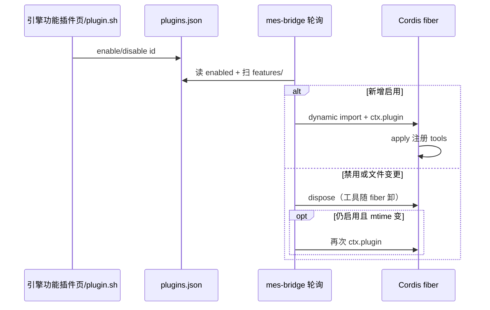
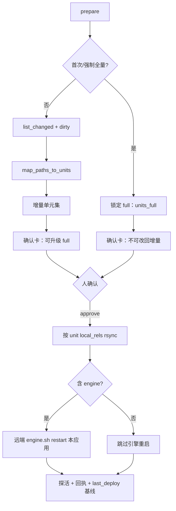
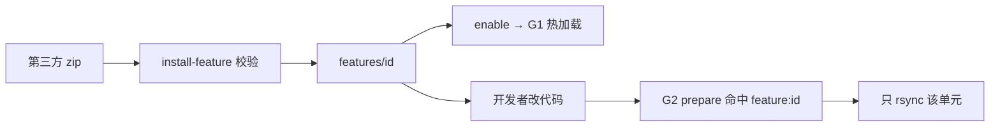

# WorkBuddy 三大核心目标落地方案

> **状态**：立项对齐（贯穿后续实施）  
> **依据**：领导要求 + 根目录 `AGENTS.md` 架构铁律  
> **产品入口**：WorkBuddy **独立应用**（引擎网页 / API 为主）；DSH 提供的是**热插拔写法与插件范式**，装不装 Harness 窗口**不作为**本方案验收项  

---

## 0. 三大核心目标（北星）


| #      | 目标                      | 一句话                                                   |
| ------ | ----------------------- | ----------------------------------------------------- |
| **G1** | 用 DSH 的热插拔写法做 WorkBuddy | 新能力只进 `features/`，启停约 1s，不往 profile 堆业务正式包            |
| **G2** | 按单元增量部署「改哪发哪」           | Git/脏文件 → 部署单元 → 人确认 → 只 rsync 命中单元并按单元收尾             |
| **G3** | 在 WorkBuddy 内安装第三方能力    | 体验对齐「DSH 装技能」：交付物进 `features/`，校验 → 启用 → 热加载 → 可按单元部署 |


三条必须**同时**满足；任一倒退（例如业务再做成第二个 bridge、全仓糊部署、第三方只能改源码拷贝且无启停）视为方案失败。

**明确不纳入本方案验收**

- 员工是否打开 DSH / Harness 聊天窗口  
- 远端是否安装完整 DSH profile（除非未来单独立项「宿主演示环境」）  
- GitHub Actions / 境外 CI、无人自动部署

---

## 1. 总架构（三条目标如何咬合）

```text
┌──────────────────────────────────────────────────────────────────┐
│  WorkBuddy 独立应用（引擎 SPA + HTTP + CLI）                        │
│  验收主入口：浏览器打开引擎页 / 探活 URL                              │
└───────────────┬───────────────────────────────┬──────────────────┘
                │                               │
     G1 热插拔   │                               │  G2 增量部署
                ▼                               ▼
┌───────────────────────────┐     ┌─────────────────────────────────┐
│ features/<id>/            │     │ code_deploy                     │
│ + plugins.json（启停真相） │     │ diff → units → confirm → rsync  │
│ + bridge 轮询 ctx.plugin  │     │ feature:* / engine / …          │
└─────────────┬─────────────┘     └────────────────┬────────────────┘
              │ G3 安装入口                         │
              ▼                                     │
┌───────────────────────────┐                       │
│ install-feature（规划）    │──落地同一 features/ ──┘
│ zip/git/目录 → 校验 → enable │   第三方插件也可「只发该单元」
└───────────────────────────┘
```

**分层铁律（实施中禁止推翻）**


| 层             | 路径                   | 职责                                 |
| ------------- | -------------------- | ---------------------------------- |
| 框架脚本          | `scripts/`、`vendor/` | 脚手架、link、engine 启停；不写业务文案/密钥       |
| 唯一常驻 Cordis 包 | `plugins/mes-bridge` | 热插拔宿主、提供 `mesEngine`；**禁止**再增业务正式包 |
| 库             | `plugins/*-runtime`  | Node 能力封装，`cordisPlugin: false`    |
| 业务插件          | `features/`*         | **唯一**加 Agent/工具能力的地方              |
| 算数            | `engine/app/`*       | HTTP/CLI 真相；密钥在 `config.yaml`      |


---

## 2. 目标 G1：热插拔写法（详细技术实现）

### 2.1 已落地（基线，禁止回退）


| 组件     | 路径                                                | 行为                                                                         |
| ------ | ------------------------------------------------- | -------------------------------------------------------------------------- |
| 启停真相源  | `engine/data/plugins.json`                        | `{"enabled":["mes-ask",…]}`；flock 写入                                       |
| 目录扫描   | `engine/app/plugins_store.py`                     | available = 扫描 `features/*/index.js`，**禁止**前端写死白名单                         |
| HTTP   | `/api/plugins`、enable/disable                     | 引擎便利写入口；语义仍是改同一文件                                                          |
| CLI/脚本 | `scripts/plugin.sh … features|enable|disable|new` | 与 HTTP 同源或本地写 state                                                        |
| 加载器    | `plugins/mes-bridge/lib/index.js`                 | 约 1s 读 state；`ctx.plugin(mod)`；mtime 变更 dispose+reload；单 feature try/catch |
| 样板     | `features/mes-ask/`                               | `export name/inject/apply`；`eng.defineTool` + `runEngine`                  |


### 2.2 Feature 硬性契约（第三方与自研同一套）

每个 `features/<id>/` **必须**：

1. `index.js` + `manifest.json`（`id` 与目录名一致）
2. Cordis 导出：`export const name`、`export const inject`、`export function apply(ctx)`
3. `inject` 最低 `["tools"]`；调用 `attachChart` 必须 `["tools","attachments"]`
4. **禁止** `import` / `require` 任何 npm（含 `@deepseek-ai/`*、`mes-runtime`）
5. 一律：`const eng = ctx.get("mesEngine")`；没有则打日志 `return`
6. 注册工具只用 `eng.defineTool`；算数只用 `eng.runEngine([...])`
7. 副作用只挂在 `apply` 的 fiber 上；禁止模块顶层定时器/改全局
8. 工具名全局唯一（建议 `mes_` 前缀）
9. `description` 含能力说明 + 1～2 个中文示例问法

`<id>`：小写字母开头，仅 `[a-z0-9_-]`。

### 2.3 热插拔时序




### 2.4 G1 实施清单（补强，非推倒重来）


| 项             | 现状                  | 落地动作                                                      | 验收                |
| ------------- | ------------------- | --------------------------------------------------------- | ----------------- |
| 自研新能力         | `plugin.sh new` 已有  | 继续强制走 new；MR 检查目录在 `features/`                            | checklist         |
| 引擎侧管理页        | 已有「功能插件」            | 列表字段对齐 manifest（name/purpose/version）                     | UI 与扫描一致          |
| 加载失败隔离        | 单 feature try/catch | 保持；失败标 `live=error` 不影响邻居                                 | 故意坏语法只挂一个         |
| 无 bridge 时的开发 | 引擎 SPA 可测多数车道       | 文档写明：G1 加载器依赖 bridge 进程；**产品验收以引擎页+API 为准**               | 见 §6              |
| 契约自动检查        | 弱                   | 新增 `scripts/check-features.sh`：扫 export/inject/禁止 require | CI 或 `test.sh` 调用 |


**建议 `check-features.sh` 检查项（实现规格）**

- 每个子目录存在 `index.js`、`manifest.json`  
- manifest.`id` == 目录名  
- `index.js` 含 `export const name`、`export const inject`、`export function apply`  
- 禁止出现 `require(` / `from '` / `from "`（允许注释豁免需审慎）  
- `name` 字符串与目录名一致（或显式允许别名表）

### 2.5 G1 风险与禁令

- 禁止再 `plugin.sh install` 业务正式 Cordis 包  
- 禁止 feature 内写死端口/绝对路径/密钥  
- 禁止把热插拔说成「一切 UI 可热插拔」（引擎 SPA 静态资源随 **engine 单元**发布）

---

## 3. 目标 G2：按单元增量部署（详细技术实现）

### 3.1 已落地（基线）


| 模块      | 路径                                | 职责                                                |
| ------- | --------------------------------- | ------------------------------------------------- |
| 单元定义    | `engine/app/code_deploy/units.py` | 路径 → `feature:<id>` / `engine` / `bridge` / …     |
| Diff    | `diff_map.py`                     | base..HEAD + dirty；`-z` + `quotepath=false`（中文路径） |
| 策略      | 全量锁定 / 增量可升级全量                    | 二元，无「建议全量」软模式                                     |
| Job     | prepare → awaiting → confirm      | 人确认或 `confirmed=true`                             |
| 同步      | `ssh_sync.py`                     | 按单元 `local_rels` rsync；排除密钥                       |
| 收尾      | engine 重启本应用引擎                    | 探活；回执 `last_deploy_receipt.json`                  |
| Feature | `features/code-deploy/`           | `mes_code_deploy_`*                               |
| 配置      | `config.yaml` → `code_deploy`     | SSH、环境、开关                                         |


权威说明仍见：[P1-自动化部署-按单元增量.md](./功能实现/P1-自动化部署-按单元增量.md)。本方案规定 **G2 在三大目标中的优先级与验收口径**。

### 3.2 单元表（实施契约）


| 变更落点                               | 单元 id          | 同步内容            | 成功收尾（本方案默认）                                                          |
| ---------------------------------- | -------------- | --------------- | -------------------------------------------------------------------- |
| `features/<id>/`                   | `feature:<id>` | 该目录             | 无进程重启；靠热加载（远端若跑 bridge 则约 1s）                                        |
| `engine/app`、`static`、依赖等          | `engine`       | 引擎树（按 units 定义） | **重启本应用引擎** + 探活                                                     |
| `plugins/mes-bridge`、`mes-runtime` | `bridge`       | 插件目录            | **默认仅同步**（`auto_restart_bridge=false`）；显式 true 才宿主收尾；**不作为员工网页成败条件** |
| 脚手架/scripts 等                      | 见 units        | 常触发 **强制全量**    | 全量单元集                                                                |


**G2 与产品入口对齐（重要）**

- **员工/业务验收**：`engine`（及命中的 `feature:`*）同步成功 + 引擎探活通过 → **部署成功**。  
- `bridge` 单元：可同步文件；宿主重启失败或跳过 → **不得单独把整单打成业务失败**（已实现「无 profile 则跳过重启并警告」方向）；确认卡须写清「本环境是否要求宿主收尾」。

### 3.3 增量判定流水线




### 3.4 G2 实施清单（补强）


| 项              | 动作                                               | 验收                             |
| -------------- | ------------------------------------------------ | ------------------------------ |
| 中文路径           | 保持 `-z` / quotepath=false / `_decode_git_path`   | 确认卡无 `docs//345/...`           |
| 第三方 feature 部署 | `feature:<id>` 已映射                               | 只改第三方目录 → 增量仅该单元               |
| 成功卡/回执         | `mode`、`unit_ids`、`synced_rels`、`engine_restart` | 与「改哪发哪」可核对；不以 find -cmin 混多次为准 |
| 配置中心           | 部署车道开关、SSH、环境                                    | 未启用有明确提示                       |
| 文档/文案          | P1 与本方案统一：业务成功 = 引擎侧                             | 确认卡「动作」对员工环境不强调必重启宿主           |


### 3.5 G2 禁令

- 禁止无确认的自动部署  
- 禁止把密钥、`config.yaml`、私钥打进 rsync  
- 禁止 Node feature 内直接 `spawn` SSH  
- 禁止「全仓 scp」代替单元表

---

## 4. 目标 G3：WorkBuddy 内安装第三方能力（详细技术实现）

### 4.1 目标体验（对齐「DSH 装技能」）

用户在 **WorkBuddy 引擎「功能插件」页**（或 CLI）能够：

1. 选择来源：本地目录 / zip 包 / git URL（可分阶段）
2. 系统自动校验契约（§2.2）
3. 解压/拷贝到 `features/<id>/`
4. 写入 enable → 热加载
5. 列表中可见、可禁用、可卸载（删目录或移入 quarantine）
6. 之后 G2 部署只发该 `feature:<id>`（若仅该处变更）

### 4.2 现状 vs 缺口


| 能力                  | 现状       | 缺口           |
| ------------------- | -------- | ------------ |
| 目录约定 + enable       | ✅        | —            |
| `plugin.sh new` 脚手架 | ✅        | 仅空白模板        |
| 第三方整目录拷入            | ✅ 手工     | 无统一校验/安装命令   |
| 一键 zip/git 安装       | ❌        | **本目标主建设项**  |
| 应用内「插件中心」UI         | 部分（列表启停） | 安装向导、来源、校验报告 |
| 签名/来源白名单            | ❌        | 企业级可选增强      |


### 4.3 交付物规范（第三方必须提供）

```text
my-plugin/
  manifest.json     # id, name, purpose, version, author, engine_api_min?
  index.js          # Cordis feature，无 npm import
  README.md         # 中文：能力、示例问法、是否需新 cli 命令
  # 若需新算数：同时提交或附带 patch
  #   engine/app/... 与 cli_ops 命令说明（由应用方合并，禁止只在 Node 私接）
```

`manifest.json` 建议字段（安装器读取）：

```json
{
  "id": "vendor-foo",
  "name": "示例第三方能力",
  "purpose": "…",
  "version": "1.0.0",
  "author": "…",
  "requires_engine_commands": [],
  "inject": ["tools"]
}
```

### 4.4 安装器设计（`install-feature`）

**CLI（优先实现，与 DSH「装包」心智一致）**

```bash
# 本地目录
scripts/plugin.sh --app zr-workbuddy install-feature /path/to/my-plugin

# zip
scripts/plugin.sh --app zr-workbuddy install-feature ./vendor-foo.zip

# 规划：git
scripts/plugin.sh --app zr-workbuddy install-feature --git https://… --ref v1.0.0
```

**实现要点（建议落在 `scripts/plugin.sh` + `engine/app/feature_install.py`）**

1. **解包到临时目录**（zip/git clone --depth 1）
2. **校验**
  - id 合法且不与现有目录冲突（或 `--force` 覆盖策略显式）  
  - 契约检查（复用 `check-features` 逻辑）  
  - 扫描禁止 `require`/`import` npm  
  - 若 `requires_engine_commands` 非空：检查当前 `cli_ops` 是否已注册，否则安装结果 = `needs_engine_merge`（**不得静默当成功可用**）
3. **原子落入** `features/<id>/`（先写 `.partial` 再 rename）
4. **enable**（写 `plugins.json`）
5. **返回** JSON：`ok`、`id`、`warnings`、`live` 提示

**HTTP（引擎管理页）**

```http
POST /api/plugins/install
Content-Type: multipart/form-data  # zip
# 或 JSON { "source": "path"|"git", ... }

GET  /api/plugins/install/preflight  # 只校验不写入
DELETE /api/plugins/{id}             # 禁用 + 可选删除目录
```

中文 `tags`/`summary`/`description` 按仓库 API 规范补齐。

**卸载**

- `disable` 后可选 `uninstall-feature <id>`：移出 `features/` 到 `engine/data/feature_quarantine/<id>-<ts>/`（保留审计，避免误删不可恢复）

### 4.5 安全与企业约束


| 项       | 策略                                                 |
| ------- | -------------------------------------------------- |
| 代码执行面   | 动态 `import` 的是本机/已安装文件；仅管理员可装                      |
| 无任意 npm | 降低供应链面；第三方 SDK → 必须经 runtime/engine 评审合入           |
| 密钥      | 禁止打进 feature；第三方文档示例也禁止真密钥                         |
| 来源      | 配置 `feature_install.allow_git: false` 默认；企业可开白名单域名 |
| 配额      | 单插件体积上限、文件数上限（对齐审码 local_files 思路）                 |


### 4.6 与 G1/G2 的衔接




### 4.7 G3 分阶段实施


| 阶段         | 交付                                                                                      | 工期量级（参考） |
| ---------- | --------------------------------------------------------------------------------------- | -------- |
| **P0**     | `check-features` + 文档化「手工拷贝 + enable」验收清单 + 样例第三方目录（可放 `docs/examples/sample-feature/`） | 小        |
| **P1**     | `install-feature` 支持 **目录 + zip**；CLI + `/api/plugins/install`；管理页上传 zip                | 中        |
| **P2**     | git 源、quarantine 卸载、preflight 报告 UI、来源白名单                                               | 中        |
| **P3**（可选） | 签名校验、内部插件登记册、与权限/审计对接                                                                   | 大        |


---

## 5. 跨目标工程纪律

### 5.1 目录与命令（日常）

```bash
# G1：新自研能力
scripts/engine.sh zr-workbuddy ensure
scripts/plugin.sh --app zr-workbuddy new <id> "说明"
# 编辑 features/<id>/
scripts/plugin.sh --app zr-workbuddy features

# G3：装第三方（P1 落地后）
scripts/plugin.sh --app zr-workbuddy install-feature ./something.zip

# G2：部署
# 引擎页或工具：部署准备 → 确认卡核对 unit_ids → 确认
# 核对：远端 last_deploy_receipt.json 的 mode / unit_ids / synced_rels
```

### 5.2 测试与门禁


| 检查         | 命令/方式                           | 覆盖                          |
| ---------- | ------------------------------- | --------------------------- |
| 单测         | `scripts/test.sh zr-workbuddy`  | units 映射、diff、plugins_store |
| 密钥         | `scripts/check-secrets.sh`      | 防提交密钥                       |
| Feature 契约 | `scripts/check-features.sh`（新建） | G1/G3                       |
| 手工         | 启停 feature；增量只改一 feature 看确认卡单元 | G1/G2                       |


### 5.3 文档同步要求

凡改动影响三大目标，必须更新：

- 本文（若契约/阶段变化）  
- [AGENTS.md](../AGENTS.md)（若铁律变化——需谨慎）  
- G2 细则：[P1-自动化部署-按单元增量.md](./功能实现/P1-自动化部署-按单元增量.md)  
- [目录结构与用法说明.md](./目录结构与用法说明.md) 大白话入口

---

## 6. 总验收对照（领导视角）


| 目标  | 验收语句          | 通过标准                                                              |
| --- | ------------- | ----------------------------------------------------------------- |
| G1  | 「加能力不用改宿主大包」  | 新能力只出现在 `features/`；enable 后约 1s 可用；disable 后工具消失                 |
| G2  | 「改哪发哪」        | 只改 `features/foo` → 确认卡增量单元主要为 `feature:foo`；rsync 不同步无关树；引擎变更有探活 |
| G3  | 「能像装插件一样装第三方」 | zip/目录经安装器校验后出现在功能列表并可启停；不合规包被拒绝并给出中文原因                           |


**不作为失败理由**：本机未开 Harness、远端无 DSH profile（在默认员工网页场景下）。

---

## 7. 近期实施顺序（建议）

1. **固化叙事**：README / 目录说明增加「三大核心目标」入口（本文）——避免再绕宿主窗口。
2. **G1 补强**：`check-features.sh` + CI/test 挂钩。
3. **G2 收口**：确认卡/成功卡业务口径与中文路径；bridge 非业务成败。
4. **G3 P0→P1**：样例包 + `install-feature`（目录/zip）+ 管理页上传。
5. 再开 G3 P2（git/白名单）按企业需要。

---

## 8. 相关文档


| 文档                                            | 关系                   |
| --------------------------------------------- | -------------------- |
| [AGENTS.md](../AGENTS.md)                     | 写码/插件铁律              |
| [目录结构与用法说明.md](./目录结构与用法说明.md)                | 日常命令                 |
| [P1-自动化部署-按单元增量.md](./功能实现/P1-自动化部署-按单元增量.md) | G2 详细实现              |
| [功能迁移-写码审码提交自动化.md](./功能迁移-写码审码提交自动化.md)      | 写码/审码/提交等能力线（服从三大目标） |


---

## 9. 一句话结论

**整仓实施以三件事为纲：features 热插拔、按单元增量部署、第三方只经校验装进 features。**  
DSH 贡献的是这套**插件式工程方法**；WorkBuddy 作为**独立应用**交付员工网页与引擎能力，并用同一套方法扩展与发布。