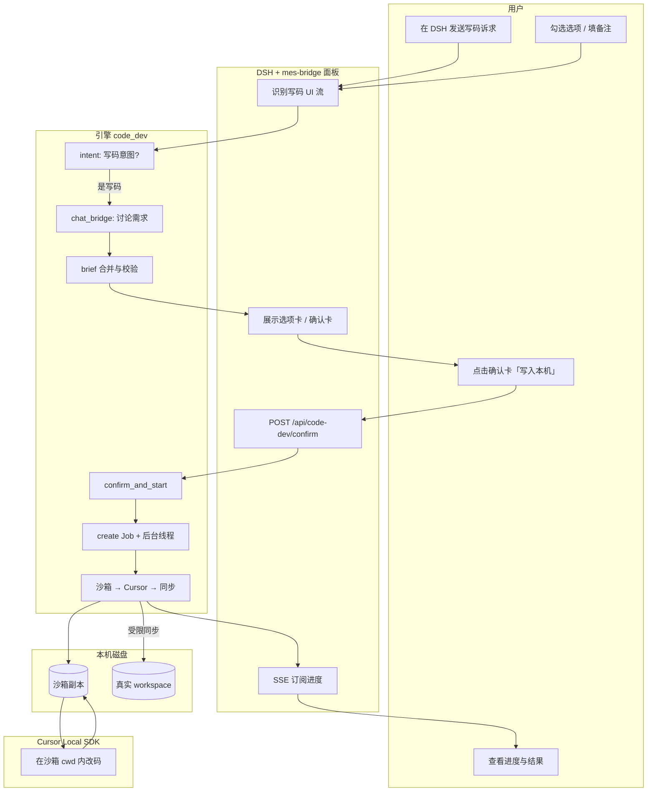
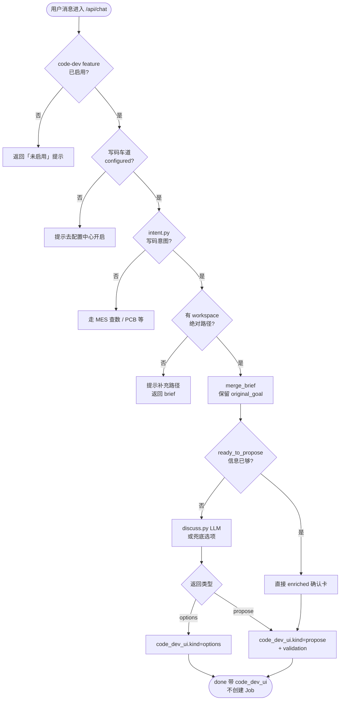
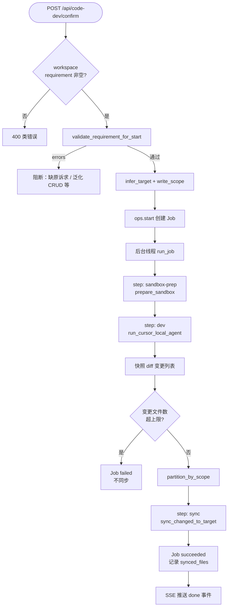
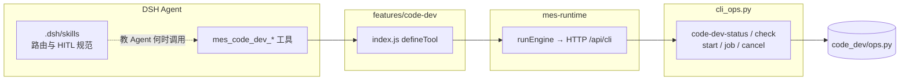
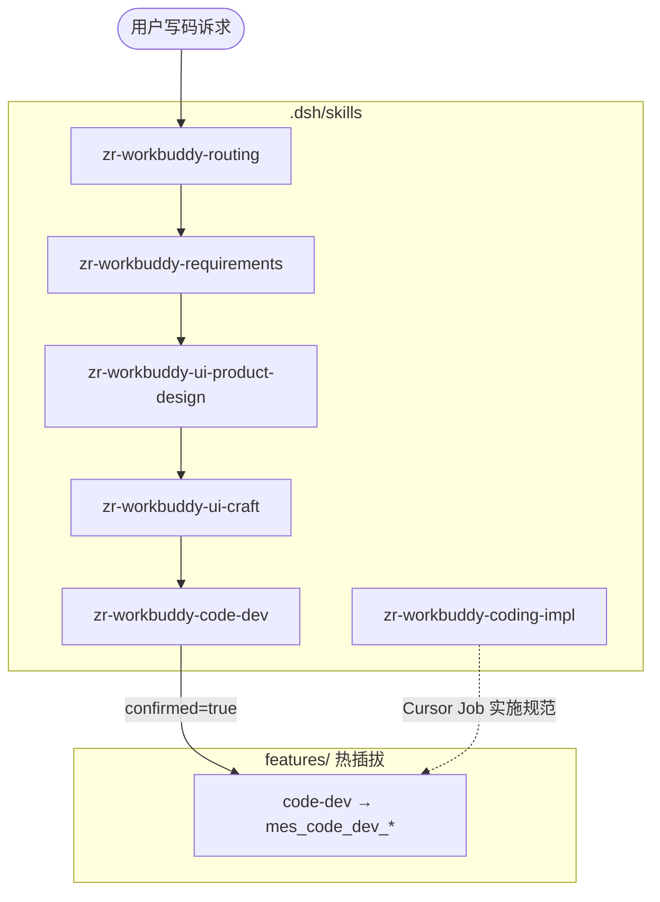

# P0-1 本机写码功能实现说明

> **状态**：已实现（P0-1）  
> **范围**：本机 Cursor Local 写码 + 人机确认（HITL）+ 进度回显  
> **不包含**：自动 Git 提交（P0-2）、审码（P0-3）、定时自动化（P0-4）

---

## 1. 一句话总结（给非技术人员）

用户在 DSH 聊天里说出「要在某台电脑上的项目里改代码 / 做页面」，系统**不会立刻改文件**，而是先像产品经理一样**问清楚、出选项、出确认卡**；用户点「确认并用 Cursor 写入本机」后，后台在**隔离副本（沙箱）**里让 Cursor AI 改代码，改完再把**允许范围内的文件**同步回真实项目目录，并在界面里**逐步显示进度**。全程**不会自动提交 Git**。

---

## 2. 达到的效果

| 效果 | 说明 |
| --- | --- |
| **安全起步** | 默认关闭写码车道；须配置中心开启 + 填 Cursor API Key |
| **人先确认再动手** | 聊天路径禁止自动开工；必须确认卡或 Agent 显式 `confirmed=true` |
| **需求不跑偏** | 跨轮保留「原始诉求」；服务端拦截泛化 CRUD、模块错配 |
| **改码有隔离** | 先在沙箱改，再受限同步，敏感文件跳过 |
| **进度可见** | SSE 流式推送四步流水线：准备沙箱 → Cursor 改码 → 同步 → 完成 |
| **热插拔** | `code-dev` feature 可 ~1s 启停；不改 DSH 本体 |
| **Agent 可协作** | DSH Skill 教路由与流程；`mes_code_dev_*` 工具供 Agent 查询/启动 |

---

## 3. 用到的技术

### 3.1 技术清单

| 技术 | 用在哪 | 作用 |
| --- | --- | --- |
| **DSH + Cordis** | 聊天宿主、`mes-bridge` | 面板 UI、Agent 会话、工具注册 |
| **FastAPI** | 引擎 `:8000` | HTTP API、SSE 进度流、`/api/chat` |
| **Python 3** | `engine/app/code_dev/` | 意图识别、需求讨论、Job、沙箱、同步 |
| **cursor-sdk（Python）** | `cursor_agent.py` | 本机 Cursor Local Agent，沙箱 cwd 内改码 |
| **Node.js（feature）** | `features/code-dev/` | 薄封装：`runEngine` 调 CLI，无 npm 业务逻辑 |
| **SSE（Server-Sent Events）** | `/api/code-dev/jobs/{id}/stream` | 浏览器实时收进度 |
| **localStorage** | DSH 面板 `client.js` | 会话内 `codeDevBrief` 跨轮累积 |
| **DSH Skill（SKILL.md）** | `.dsh/skills/zr-workbuddy-*` | 教 Agent 何时写码、如何收集需求（与 feature 并列） |
| **LLM（可选）** | `discuss.py` | 出需求选项卡 / 确认卡文案；未配置时有兜底选项 |

### 3.2 大白话：这些技术各自干什么？

- **DSH**：像「前台服务员」，用户在这里说话；服务员可以调各种工具。
- **引擎（后厨）**：真正算数、跑写码任务的服务，只在本机 `127.0.0.1` 监听，不对外网开放。
- **mes-bridge**：挂在 DSH 上的「总管插件」，负责把 `features/` 里的能力插拔上去，并嵌入写码聊天面板。
- **feature（code-dev）**：一张「菜单条目」，告诉 Agent 有哪些写码工具名可以调用。
- **沙箱**：把项目**复印一份**到临时目录，AI 只改复印件，改完再按规则**抄回**真项目。
- **Cursor Local**：Cursor 官方 SDK，在本机跑 AI 程序员，在沙箱目录里读写代码。
- **SSE**：像直播弹幕，服务器一行行推进度，浏览器不用反复刷新。
- **Skill**：给 AI 看的「工作手册」，不写进代码，DSH 自动注入对话上下文。

---

## 4. 架构分层与实现机制

### 4.1 分层（铁律）

```text
┌─────────────────────────────────────────────────────────────┐
│  DSH 聊天 + mes-bridge 面板（client.js）                      │
│  · 展示思考 / 选项卡 / 确认卡 / 进度卡                        │
│  · localStorage 存 codeDevBrief                              │
└──────────────────────────┬──────────────────────────────────┘
                           │ HTTP 127.0.0.1:8000
┌──────────────────────────▼──────────────────────────────────┐
│  引擎 FastAPI（main.py + code_dev/*）                         │
│  · 意图分流 · 需求讨论 · 确认校验 · Job 调度 · SSE           │
└──────────────────────────┬──────────────────────────────────┘
                           │ 后台线程
┌──────────────────────────▼──────────────────────────────────┐
│  Cursor Local（cursor-sdk）在沙箱 cwd 内执行                  │
└──────────────────────────┬──────────────────────────────────┘
                           │ 快照 diff + 受限 copy
┌──────────────────────────▼──────────────────────────────────┐
│  用户本机真实工程目录（workspace）                            │
└─────────────────────────────────────────────────────────────┘

侧向：features/code-dev → runEngine → cli_ops（与 HTTP 同源）
侧向：.dsh/skills → DSH Agent 上下文（不替代 feature）
```

### 4.2 核心机制说明

#### （1）HITL：Human-In-The-Loop（人在回路）

- **聊天 `/api/chat`** 识别写码意图后，只返回 `code_dev_ui`（选项或确认卡），**不创建 Job**。
- **唯一开工入口**：`POST /api/code-dev/confirm`（面板点确认）或 CLI/Agent `code-dev-start`（须 `confirmed=true`）。
- 机制目的：防止 AI 误听一句「帮我改一下」就直接改生产代码。

#### （2）Brief 需求简报

- 字段：`original_goal`（用户第一句原话）、`workspace`、`selections`（勾选历史）、`notes`、`option_rounds`。
- 面板每轮把 `code_dev_brief` 随 chat 请求带回引擎；`merge_brief` 合并，**禁止长摘要覆盖原诉求**。
- `build_requirement()` 生成含 `【原始诉求】` 的 canonical 摘要；`validate_requirement_for_start()` 在 confirm 时硬拦截。

#### （3）沙箱 + 快照 diff + 受限同步

1. `prepare_sandbox`：拷贝 workspace → `engine/data/local_dev/sandboxes/{job_id}/`（跳过 `node_modules`、`.git` 等；敏感路径不拷）。
2. `snapshot_sandbox`：改码前后各拍一次文件哈希清单。
3. `diff_snapshots`：算出变更文件列表；超过 `max_changed_files` 则**中止同步**。
4. `write_scope`：按目标模块（如「报表中心」）限制可同步路径；范围外变更**不同步**。
5. `sync_changed_to_target`：只把允许的文件从沙箱写回 workspace。

#### （4）Feature 热插拔

- 真相源：`engine/data/plugins.json` 的 `enabled` 列表。
- bridge 约 1s 轮询 → `ctx.plugin` 加载 `features/code-dev/index.js` → 注册 `mes_code_dev_*` 工具。
- `disable code-dev` 后工具从 Agent 消失；Skill 仍在但调不到工具。

#### （5）SSE 进度

- 固定四步 UI 语义：`boot` → `sandbox-prep` → `dev`（含 Cursor 过程）→ `sync`。
- 面板订阅 `GET /api/code-dev/jobs/{id}/stream`，收到 `step` / `log` / `done` 事件更新进度卡。

---

## 5. 详细流程图

### 5.1 总览：从用户说话到文件落盘



### 5.2 聊天 HITL：需求收集子流程



### 5.3 确认开工与 Job 执行



### 5.4 Agent / Feature 工具链



### 5.5 DSH Skill 与 Feature 协作（不写进代码的「手册层」）



---

## 6. 关键模块与文件

| 模块 | 路径 | 职责 |
| --- | --- | --- |
| 意图识别 | `code_dev/intent.py` | 写码 vs 查数分流；提取绝对路径 |
| 需求讨论 | `code_dev/discuss.py` | LLM 出选项卡/确认卡机器块 |
| 需求简报 | `code_dev/brief.py` | 保真、校验、write_scope、模块关键词 |
| 聊天桥接 | `code_dev/chat_bridge.py` | chat 只讨论；confirm 才 start |
| Job 存储 | `code_dev/jobs.py` | JSON 账本 `local_dev/jobs/` |
| 执行服务 | `code_dev/service.py` | 沙箱→Cursor→同步主流程 |
| Cursor 封装 | `code_dev/cursor_agent.py` | cursor-sdk LocalAgent |
| 沙箱 | `code_dev/sandbox.py` | 拷贝、敏感路径、同步 |
| 命令面 | `code_dev/ops.py` | CLI/HTTP 统一入口 |
| HTTP | `main.py` | chat、confirm、job、stream |
| Feature | `features/code-dev/index.js` | Agent 工具注册 |
| 面板 | `mes-bridge/lib/client.js` | 卡片 UI、brief、SSE |
| 引擎 SPA | `static/index.html` | 配置中心写码车道、同类卡片 |
| 单测 | `engine/tests/test_code_dev.py` | brief/校验/confirm 等 |

---

## 7. 配置与数据目录

### 7.1 配置（配置中心 → `config.yaml`）

```yaml
code_dev:
  enabled: false          # 总开关
  cursor_api_key: ""      # Cursor API Key（密钥，勿提交）
  model: composer-2.5     # Cursor 模型
  max_concurrent: 1       # 同时进行 Job 数
  cursor_timeout_sec: 2700
  default_workspace: ""   # 可选默认工程路径
```

### 7.2 运行时数据

| 路径 | 内容 |
| --- | --- |
| `engine/data/plugins.json` | feature 启停（含 `code-dev`） |
| `engine/data/local_dev/jobs/*.json` | Job 状态、synced_files、错误信息 |
| `engine/data/local_dev/sandboxes/{job_id}/` | 沙箱副本（已在 .gitignore） |

---

## 8. 主要 API（引擎）

| 接口 | 方法 | 说明 |
| --- | --- | --- |
| `/api/chat` | POST | 写码意图 → 返回 `code_dev_ui`，**不开工** |
| `/api/code-dev/confirm` | POST | 用户确认后创建并启动 Job |
| `/api/code-dev/jobs/{id}` | GET | 查询 Job 终态/详情 |
| `/api/code-dev/jobs/{id}/stream` | GET | SSE 进度流 |

CLI 同源命令：`code-dev-status`、`code-dev-check`、`code-dev-start`、`code-dev-job`、`code-dev-cancel`（见 `cli_ops.py`）。

---

## 9. 风险点

| 风险 | 现状 | 缓解 |
| --- | --- | --- |
| **误改本机工程** | 直接改 workspace 风险高 | 沙箱先行；默认 `enabled:false`；变更文件数上限 |
| **改错模块** | LLM 把「工时报表」泛化成消息中心 CRUD | brief 保真 + confirm 服务端校验 + write_scope |
| **敏感文件泄露/覆盖** | `.env`、密钥、`.ssh` | 拷贝/同步跳过敏感 basename 与路径 |
| **范围外文件被同步** | 高置信模块推断错误 | write_scope 限制；范围外 deferred；同步后 mismatch 警告 |
| **未确认就开工** | Agent 误调 start | chat 禁 auto start；start 须 confirmed；Skill 约束 |
| **引擎 HTTP 无鉴权** | 仅 127.0.0.1 | 依赖本机网络隔离；不对 LAN 暴露 |
| **Cursor 额度/失败** | SDK 报错或超时 | status 清晰提示；失败 Job 不半截同步 |
| **客户端可篡改 brief** | brief 从浏览器上传 | 服务端从 requirement 正文复验模块与关键词 |
| **沙箱占磁盘** | 大项目拷贝 | 跳过 node_modules 等；Job 完成后可手工清理 sandboxes |
| **LLM 讨论质量** | 未配 LLM 时用兜底选项 | 仍可走选项→确认；备注必填轮次 |

---

## 10. 后续优化与扩展建议

### 10.1 近期（P0 内）

| 项 | 说明 |
| --- | --- |
| **P0-2 提交确认** | 基于 `synced_files` 账本，SPA「待确认提交」→ 人点后再 git commit |
| **Job 历史页** | 引擎 SPA 列出 `local_dev/jobs`，可复查同步文件与错误 |
| **续改短句** | 同一 workspace 带上 job_id 上下文，减少重复收集 |
| **brief 服务端持久化** | 减少纯信任 client localStorage |
| **write_scope 可视化** | 确认卡展示「预计只改这些路径」 |

### 10.2 中期

| 项 | 说明 |
| --- | --- |
| **P0-3 本机审码** | `code-review` feature + `local_files` 直读，无 IDE Bridge |
| **范围外变更 SPA 卡** | 用户选择是否扩大 sync 范围（当前 P0 直接跳过） |
| **模块关键词库可配置** | `MODULE_HINTS` 进配置中心，减少硬编码 |
| **Cursor 进度细粒度** | 更多 SDK 事件映射到 SSE log |

### 10.3 长期 / 明确不做（P0）

- Cursor Cloud 写码  
- 自动 commit / push / 部署  
- 第二个 bridge 或 profile 正式 Cordis 业务包  
- 在 feature 里 `import` cursor-sdk（算数必须在 engine）

---

## 11. 验收对照（简表）

1. 配置中心可开关写码车道并测就绪  
2. 聊天写码需求 → 思考 + 选项/确认卡，**不**直接出现「已启动 ldj-…」  
3. 点确认 → 进度卡 SSE → 完成展示 synced_files  
4. `disable code-dev` 后工具热卸  
5. 不自动 git commit  

完整话术见 [功能迁移-写码审码提交自动化.md](../功能迁移-写码审码提交自动化.md) §9。

---

## 12. 相关文档

| 文档 | 说明 |
| --- | --- |
| [功能迁移-写码审码提交自动化.md](../功能迁移-写码审码提交自动化.md) | P0 定稿方案与验收 |
| [目录结构与用法说明.md](../目录结构与用法说明.md) | 日常命令与分层 |
| [AGENTS.md](../../AGENTS.md) | 写码/插件架构铁律 |
| `.dsh/skills/zr-workbuddy-*` | DSH Agent 写码 Skill 链 |
