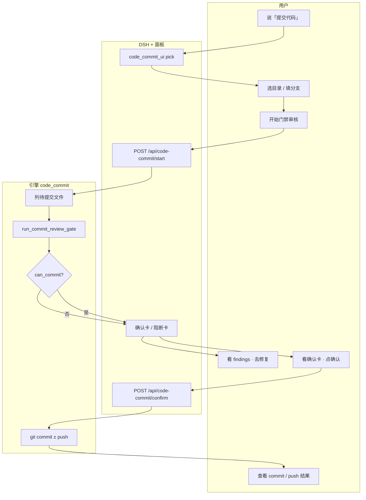
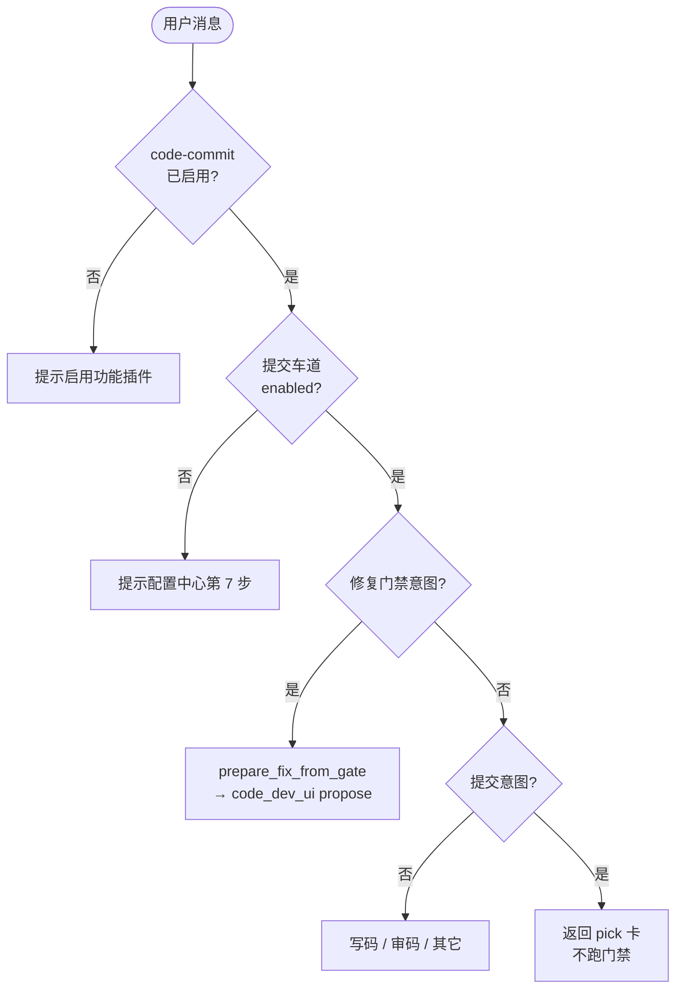
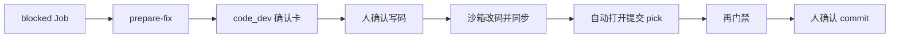
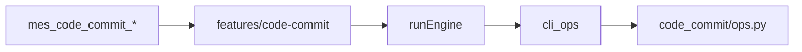

# P0-2 人触发提交功能实现说明

> **状态**：已实现（P0-2）  
> **范围**：本机 Git 选目录 → 提交门禁（findings）→ 人确认 → commit / 可选 push；门禁阻断可闭环到写码修复  
> **不包含**：自动定时提交、模型代执行 git、全量「代码审核汇总报告」、部署（P1）

---

## 1. 一句话总结（给非技术人员）

用户在 DSH 聊天里说「提交代码」时，系统**不会立刻执行 git**，而是先弹出**选目录卡**（选本机哪个工程、用哪条分支）。人点「开始门禁审核」后，系统列出本批要提交的文件，并做一轮**安全门禁**（敏感文件、危险代码等）。  
- **没过门禁**：只展示问题列表，**没有**提交按钮；可点「修复这些问题」走写码（仍须人确认），修好后再回来提交。  
- **过了门禁**：再出**确认卡**（中文提交说明、是否推送）；人点确认后，才在**工作分支**上 commit，默认再 push。全程**禁止**直接往 `main` / `master` 等保护分支提交。

---

## 2. 达到的效果

| 效果 | 说明 |
| --- | --- |
| **人先确认再 git** | 聊天不出自动 commit；须确认卡或 Agent `confirmed=true` |
| **先门禁再提交** | `start` 出 findings；`can_commit=false` 时无法确认提交 |
| **只审本批、不出长报告** | 门禁返回 findings **列表**，不是审码功能那份「代码审核汇总报告」 |
| **提交范围合理** | 写码同步池仍脏的文件 ∪ 同仓其它可提交脏文件；噪声/敏感排除 |
| **分支安全** | 禁止保护分支；优先当前分支 → 配置工作分支 → 人手填 |
| **阻断可修复闭环** | 「修复这些问题」→ 写码确认卡（限定路径）→ 同步本机 → 再提交（仍须人确认） |
| **push 可重试** | 本地已 commit、推送失败时，只重试 push，不重复造 commit |
| **热插拔** | `code-commit` feature 可 ~1s 启停；算数在引擎 |
| **模型不执行 git** | Agent 工具不能代替人点确认 |

---

## 3. 用到的技术

### 3.1 技术清单

| 技术 | 用在哪 | 作用 |
| --- | --- | --- |
| **DSH + Cordis** | 聊天、`mes-bridge` | 选目录卡 / 门禁卡 / 确认卡 UI |
| **FastAPI** | 本机引擎 | `/api/code-commit/*` 与 CLI 同源 |
| **Python 3** | `engine/app/code_commit/` | 意图、列文件、门禁、commit/push |
| **Git（本机 CLI）** | `git_ops.py` | dirty 列表、分支、commit、push |
| **门禁规则 + Skill** | `gate.py` / `skill_review.py` | 敏感路径 + 内容正则；可选 LLM 批审 Skill |
| **code-dev（可选联动）** | 阻断修复 | `prepare-fix` → 写码确认卡 → Cursor 改码 |
| **Node.js（feature）** | `features/code-commit/` | 薄封装：`runEngine`，无 npm 业务逻辑 |

### 3.2 大白话：这些技术各自干什么？

- **选目录卡**：先问清楚「提交哪个文件夹、用哪条分支」，避免扫错仓库。
- **门禁**：像安检——本批文件里有没有 `.env`、硬编码密钥、危险写法；有问题先拦下，不给盖章。
- **确认卡**：安检通过后再让人看提交说明并点「确认」；点了才真正 `git commit`。
- **工作分支**：把提交放在功能分支上，不直接砸进 `main`/`master`。
- **修复闭环**：安检不过 → 用写码能力按 findings 路径改代码 → 再回来过安检；**不会**写码成功就自动提交。
- **feature（code-commit）**：给 Agent 的菜单（status / check / prepare / start / confirm 等）。

---

## 4. 架构分层与实现机制

### 4.1 分层（铁律）

```text
┌─────────────────────────────────────────────────────────────┐
│  DSH 聊天 + mes-bridge 面板                                   │
│  · pick 选目录 · 门禁 findings · 确认卡 · 修复按钮            │
└──────────────────────────┬──────────────────────────────────┘
                           │ HTTP 127.0.0.1（本机引擎）
┌──────────────────────────▼──────────────────────────────────┐
│  引擎 FastAPI（code_commit/*）                                │
│  · 列待提交文件 · 门禁 · Job · 人确认后 git commit/push       │
└───────────────┬─────────────────────────────┬───────────────┘
                │ 阻断修复（可选）              │ git
┌───────────────▼───────────────┐   ┌─────────▼─────────┐
│  code-dev（写码确认→沙箱→同步） │   │  本机 Git 工作区   │
└───────────────────────────────┘   └───────────────────┘

侧向：features/code-commit → runEngine → cli_ops（与 HTTP 同源）
账本：engine/data/code_commit/jobs/cc-*.json
```

### 4.2 核心机制说明

#### （1）HITL：人在回路

- 聊天识别「提交代码」→ 只返回 `code_commit_ui.kind=pick`，**不**跑门禁、**不** commit。
- 「开始门禁审核」→ `POST /api/code-commit/start`（可带 `work_branch`）。
- 门禁通过后确认卡 → `POST /api/code-commit/confirm`（或 `mes_code_commit_confirm` 且 `confirmed=true`）。
- 目的：防止 AI 听一句「帮我提交」就改 Git 历史。

#### （2）提交分支默认规则

确认卡 / 门禁预览按优先级：

1. 仓库**当前分支**（且不是保护分支）  
2. 配置中心 `code_commit.work_branch`  
3. 都没有 → 提示用户手填；**空分支不可开始门禁**

保护分支集合含：`main`、`master`、`trunk`、`production`、`prod`（不可作为提交目标）。

#### （3）本批文件怎么来

`filter_pending_commit_files` 大致逻辑：

1. 参考写码同步池（若有）与 Git dirty；  
2. 排除噪声 / 敏感 / 样式图片日志等不可提交项；  
3. 纳入可提交业务源码，以及文档 / Skill（`.md`）、SPA `index.html`、`.gitignore` 等允许类型；  
4. **范围 = 同步池仍脏 ∪ 同仓库其它 Git 可提交脏文件**（不只提交「写码刚同步的那几个」）。

LLM 深审（Skill）仍主要读功能源码；门禁整体**不出**长篇「代码审核汇总报告」。

#### （4）门禁（gate）

优先级：

1. 敏感路径（如 `.env`、密钥类文件名）→ P0 阻断  
2. 可选：`.dsh/skills` 的 commit-batch-review（`llm_freeform`）  
3. 降级：内容正则（如 `eval`、SQL 拼接、硬编码 password/api_key）→ P0/P1 阻断  

仅 **P0/P1** 影响 `can_commit`。阻断 Job 落盘为 `blocked`，含 workspace / findings / files。  
`allow_blocked` **不能**靠 yaml 放行，仅环境变量 `CODE_COMMIT_ALLOW_BLOCKED`（运维逃生，默认不用）。

#### （5）审码门禁 → 写码修复 → 再提交

| 步骤 | 触发 | 行为 |
| --- | --- | --- |
| 门禁阻断 | start 后 `can_commit=false` | 落盘 blocked Job |
| 发起修复 | 「修复这些问题」/ 阻断卡按钮 / `prepare-fix` | 读最近阻断 Job → `code_dev_ui` propose（`write_scope`=finding 路径） |
| 写码 | 人点写码确认卡 | `POST /api/code-dev/confirm`（可带 `write_scope`、`source_gate_job_id`）；**不自动 commit** |
| 写码成功后 | 面板逻辑 | **自动打开提交选目录卡**（同工程预填） |
| 再提交 | 再门禁 → 确认卡 | 仍须人点确认才 git |

须同时启用 `code-dev` 写码车道，修复才可开工。

#### （6）Feature 热插拔

- 真相源：`engine/data/plugins.json`  
- bridge 约 1s 加载 `features/code-commit/index.js` → 注册 `mes_code_commit_*`  
- disable 后工具消失；配置中心「提交车道」仍可单独关掉业务开关

---

## 5. 详细流程图

### 5.1 总览：从「提交代码」到 commit/push



### 5.2 聊天 HITL：选目录与意图



### 5.3 门禁与确认执行

```mermaid
flowchart TD
  StartGate([POST start]) --> Br{分支合法且<br/>非保护?}
  Br -->|否| Err1[阻断：请填工作分支]
  Br -->|是| List[filter_pending_commit_files]
  List --> Empty{有可提交文件?}
  Empty -->|否| Err2[无可提交变更]
  Empty -->|是| Gate[敏感路径 + Skill/正则]
  Gate --> Ok{can_commit?}
  Ok -->|否| Blocked[Job blocked<br/>无确认提交按钮]
  Ok -->|是| Await[Job awaiting_confirm<br/>出确认卡]
  Await --> Confirm([POST confirm<br/>confirmed]
  Confirm --> Msg{中文 message<br/>合法?}
  Msg -->|否| Err3[驳回]
  Msg -->|是| Git[工作分支 commit<br/>可选 push]
  Git --> PushFail{仅 push 失败?}
  PushFail -->|是| Retry[保留可 push-retry]
  PushFail -->|否| Done[Job done]
```

### 5.4 阻断修复闭环



### 5.5 Agent / Feature 工具链



常用工具：`status` / `check` / `prepare` / `start` / `confirm`（须 `confirmed=true`）/ `prepare_fix` / `push_retry` / `job`。

---

## 6. 关键模块与文件

| 模块 | 路径 | 职责 |
| --- | --- | --- |
| 配置 | `code_commit/config.py` | `code_commit:` 开关、workspace、work_branch、default_push 等 |
| 意图 | `code_commit/intent.py` | 「提交代码」/「修复这些问题」分流 |
| Git | `code_commit/git_ops.py` | dirty、中文 message、分支、commit/push/重试 |
| 门禁 | `code_commit/gate.py` | 敏感路径 + 内容规则；汇总 `can_commit` |
| Skill 批审 | `code_commit/skill_review.py` | `llm_freeform` + commit-batch-review Skill |
| 存储 | `code_commit/store.py` | `data/code_commit/jobs/`；`latest_blocked_job` |
| 命令面 | `code_commit/ops.py` | status/check/prepare/start/confirm/prepare-fix/push-retry |
| 聊天桥 | `code_commit/chat_bridge.py` | pick / 修复 propose；不自动门禁或 git |
| HTTP | `main.py` | `/api/code-commit/*` |
| Feature | `features/code-commit/index.js` | Agent 工具注册 |
| 面板 | `mes-bridge/lib/client.js` | 卡片 UI、门禁后确认、修复与 pick 回流 |
| 单测 | `engine/tests/`（相关 code_commit 用例） | 门禁 / 文件过滤 / 确认约束等 |

---

## 7. 配置与数据目录

### 7.1 配置（配置中心 → `config.yaml`）

配置中心「提交车道」（约第 7 步）：

```yaml
code_commit:
  enabled: true                 # 业务开关（另需启用 feature code-commit）
  default_workspace: ""         # 选目录卡默认路径备忘
  work_branch: ""               # 当前在保护分支时的后备工作分支
  remote_name: origin
  default_push: true            # 确认卡默认是否推送
  use_skill_review: true        # 门禁是否走 LLM Skill（失败则降级正则）
  max_files: 80                 # 单批文件上限
```

说明：

- 总开关仍是功能插件 `code-commit`；yaml `enabled` 控制车道。  
- **禁止**用 yaml 配置 `allow_blocked`；仅环境变量 `CODE_COMMIT_ALLOW_BLOCKED`。  
- 密钥不进本节；Git 凭据沿用本机已有配置。

### 7.2 运行时数据

| 路径 | 内容 |
| --- | --- |
| `engine/data/plugins.json` | feature 启停（含 `code-commit`） |
| `engine/data/code_commit/jobs/cc-*.json` | 门禁 / 确认 / 阻断 / 完成态 Job |

---

## 8. 主要 API（引擎）

| 接口 | 方法 | 说明 |
| --- | --- | --- |
| `/api/code-commit/status` | GET | 车道是否就绪 |
| `/api/code-commit/check` | POST | 校验路径是否为可提交 Git 仓 |
| `/api/code-commit/prepare` | POST | 列待提交文件，不跑门禁、不 commit |
| `/api/code-commit/start` | POST | 列文件 + 门禁；可带 `work_branch` |
| `/api/code-commit/confirm` | POST | 人确认后 commit/push |
| `/api/code-commit/jobs/{id}` | GET | 查询 Job |
| `/api/code-commit/pick-ui` | POST | 刷新选目录卡（含分支预览） |
| `/api/code-commit/latest-blocked` | POST | 最近阻断 Job |
| `/api/code-commit/prepare-fix` | POST | 阻断 → 写码确认卡数据 |
| `/api/code-commit/push-retry` | POST | 仅重试 push |

CLI 同源：`code-commit-status|check|prepare|start|confirm|job|latest-blocked|prepare-fix|push-retry`。

---

## 9. 风险点

| 风险 | 现状 | 缓解 |
| --- | --- | --- |
| **模型代提交** | 口头「确认」误当执行 | confirm 须 UI/`confirmed=true`；Skill/描述约束 |
| **提交进保护分支** | 误 push main | 分支名校验 + 保护集拦截 |
| **密钥进仓库** | `.env` / pem 等 | 敏感路径门禁 + 噪声过滤 |
| **门禁漏报** | 仅规则/批审 | Skill + 正则双轨；不替代完整审码（P0-3） |
| **范围过窄** | 只提交同步池 | dirty ∪ 同步池仍脏 |
| **范围过宽** | 噪声文件 | 业务源码白名单式过滤 |
| **写码后自动 commit** | 修复闭环误触 | 写码成功只开 pick；仍须门禁+确认 |
| **重复 commit** | push 失败后再点确认 | `push-retry` 只推送；claim Job 防并发 |
| **引擎 HTTP 无鉴权** | 仅 127.0.0.1 | 不对 LAN/公网暴露 |

---

## 10. 后续优化与扩展建议

### 10.1 近期

| 项 | 说明 |
| --- | --- |
| Job 历史 SPA | 复查 findings、commit hash、push 状态 |
| 确认卡展示文件清单可折叠 | 大目录时更清晰 |
| 与 P0-3 审码结果可选引用 | 门禁前先看完整报告（仍保持门禁轻量） |

### 10.2 明确不做（P0-2）

- 无人确认的自动 commit / push  
- 定时批量提交  
- 用「代码审核汇总报告」全文代替门禁 findings  
- 在 feature 里直接调 git（算数必须在 engine）  
- 部署上线（见 P1）

---

## 11. 验收对照（简表）

1. 未开 feature / 未开车道 → 明确提示，不出确认卡  
2. 「提交代码」→ 选目录卡展示提交分支；改路径后分支预览刷新  
3. 确认前无新 commit；空分支不能开始门禁  
4. 含 `.env` 的本批 → `can_commit=false`；可「修复这些问题」→ 写码确认卡带正确工程与路径  
5. 本批可含文档 / Skill / `index.html` / `.gitignore` 等；样式/图片/日志排除  
6. 文件范围 = 写码同步池仍脏 ∪ 同仓其它可提交脏文件  
7. 门禁通过 → 确认卡 → 人点后工作分支 commit；禁止 main/master；默认 push  
8. push 失败可「重试推送」，不重复 commit  
9. **不**产出「代码审核汇总报告」全文（那是 P0-3）  
10. `disable code-commit` 后工具热卸  

完整方案语境见 [功能迁移-写码审码提交自动化.md](../功能迁移-写码审码提交自动化.md) §5.3。

---

## 12. 相关文档

| 文档 | 说明 |
| --- | --- |
| [功能迁移-写码审码提交自动化.md](../功能迁移-写码审码提交自动化.md) | P0 定稿与验收总览 |
| [P0-1-本机写码功能实现.md](./P0-1-本机写码功能实现.md) | 写码 HITL / 沙箱（修复闭环依赖） |
| [P0-3-本机审码功能实现.md](./P0-3-本机审码功能实现.md) | 完整审码报告（与门禁 findings 区分） |
| [P1-自动化部署-按单元增量.md](./P1-自动化部署-按单元增量.md) | 提交之后的部署 |
| [目录结构与用法说明.md](../目录结构与用法说明.md) | 日常命令与分层 |
| [AGENTS.md](../../AGENTS.md) | 写码/插件架构铁律 |
