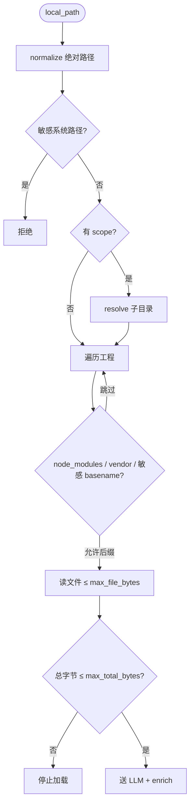

# P0-3 本机审码功能实现说明

> **状态**：已实现（P0-3）  
> **范围**：本机目录直读源码 + Viprasol Skill LLM 审查 + 规则补种 + SSE 流式终稿  
> **明确不做**：Git diff 审码、VS Code Bridge、远程克隆（P1）

---

## 1. 一句话总结

用户在 **工作助手对话**里说「审核代码」→ 出**目标目录确认卡** → 浏览/填写路径后点「开始审核」→ 引擎**直读磁盘源码**（不走 Git、不连 VS Code），按 **Viprasol + workbuddy-gate-90** 分批 LLM 审查，合并 **源码规则补种**，输出「**代码审核汇总报告**」（高/中/低危）。确认卡路径优先走 **`POST /api/code-review/run/stream`**（SSE 进度 + 终稿逐行流式）。无单独审码页。

与 **P0-2 提交审码** 的区别：P0-3 审的是「目录里现有文件」；P0-2 将来审的是「即将 commit 的 git diff」。

---

## 2. 达到的效果

| 效果 | 说明 |
| --- | --- |
| **同机直读** | 引擎与目标工程在同一台机器，127.0.0.1 |
| **无 Git / 无 IDE Bridge** | 不依赖 `git diff`、不装 VS Code 扩展 |
| **安全读取** | 后缀白名单、跳过 vendor/敏感 basename（含 `.env*`、`secrets.yml` 等）、单文件/总量上限 |
| **企业级方法论** | Skill：`.dsh/skills/zr-workbuddy-code-review/`（Viprasol MIT + gate-90） |
| **规则补种** | `enrich.py`：空 LLM ≠ 无问题；OpenAPI/Compose/密钥等高信号正则补种 |
| **并行分批** | 默认每批 8 文件、最多 3 路并行；每轮唯一 `fresh_id`，无结果缓存 |
| **结构化 findings** | severity：`critical/high/medium/low` → 报告 🔴高危 / 🟡中危 / 🟢低危 |
| **终稿体例** | 「代码审核汇总报告」：总体评价 → 详细清单（`// ❌` / `// ✅`）→ 审核结论 |
| **真流式** | SSE `token` 一行一条；前端排队逐行渲染（避免同帧刷完像整段弹出） |
| **失败不假通过** | 全部 LLM 批次无响应 → `ok=false`，结论「审查不完整」+ 报告内告警 |
| **热插拔** | `code-review` feature ~1s 启停 |
| **双入口** | 工作助手对话确认卡 + DSH Agent `mes_code_review_*` |

---

## 3. 对话触发（主入口）

用户示例：

- `审核代码` → **确认卡**选本机目录（可「浏览…」）→ 点「开始审核」
- 配置中心默认路径会预填到确认卡；也可点「常用」芯片

实现：`code_review/intent.py` 识别 → `chat_bridge` 返回 `code_review_ui.kind=pick` → SPA/bridge 挂确认卡 → **`POST /api/code-review/run/stream`**（非流式 `run` 仍保留给 CLI/Agent）。

---

## 4. 技术栈

| 技术 | 作用 |
| --- | --- |
| FastAPI | `/api/code-review/*`；流式为 SSE |
| Python `pathlib` | 遍历、读文件、路径规范化 |
| `nl_engine.llm_freeform` | 审码调用；DeepSeek V4 审码请求关闭 `thinking`（避免 reasoning 吃光 `content`） |
| Skill | `.dsh/skills/zr-workbuddy-code-review/` → `skill_prompt.build_review_system_prompt()` |
| `:::code_review_findings` | 解析结构化 JSON findings |
| `enrich.py` | 对齐 simplified 的源码规则补种 |
| features/code-review | Agent 薄工具层（禁止 feature 内 `import` npm） |

---

## 5. 流程图

### 5.1 总览（确认卡 → SSE）

```mermaid
flowchart TB
  User[用户：审核代码] --> Chat[/api/chat/stream]
  Chat --> Intent{is_code_review_question?}
  Intent -->|是| Bridge[handle_chat_code_review]
  Bridge --> Card[确认卡 code_review_ui pick]
  Card --> Pick[浏览 / 填写路径]
  Pick --> Stream[POST /api/code-review/run/stream]
  Stream --> Steps[SSE step/status]
  Steps --> Read[local_files 筛选+直读]
  Read --> Seed[enrich 规则补种]
  Seed --> Parallel[并行分批 LLM]
  Parallel --> Merge[merge findings]
  Merge --> Report[format 代码审核汇总报告]
  Report --> Tokens[SSE token 逐行]
  Tokens --> Done[done + report_id]
```

### 5.2 文件读取守卫



---

## 6. 模块与 API

| 模块 | 路径 |
| --- | --- |
| 配置 | `code_review/config.py` |
| 路径校验 | `code_review/workspace.py` |
| 直读守卫 | `code_review/local_files.py` |
| Skill 拼装 | `code_review/skill_prompt.py` |
| 规则补种 | `code_review/enrich.py` |
| LLM 审查 | `code_review/review.py`（并行分批 + `fresh_id`） |
| findings / 终稿 | `code_review/findings.py` |
| 报告存储 | `code_review/store.py` |
| 命令面 / SSE 编排 | `code_review/ops.py`（终稿按行 `token`） |
| Feature | `features/code-review/index.js` |
| 面板流式 UI | `engine/app/static/index.html`、`plugins/mes-bridge/lib/client.js` |

| HTTP | 说明 |
| --- | --- |
| `GET /api/code-review/status` | 就绪状态 |
| `POST /api/code-review/check` | 校验路径 |
| `POST /api/code-review/list` | 列出可审文件 |
| `POST /api/code-review/run` | 同步执行（CLI/Agent） |
| `POST /api/code-review/run/stream` | **推荐**：SSE `step` / `status` / `token` / `done` |
| `GET /api/code-review/reports/{id}` | 查报告 |

CLI 同源：`code-review-status` / `check` / `list` / `run` / `report`。

### 6.1 SSE 事件约定

| type | 含义 |
| --- | --- |
| `step` | 进度流水线：`validate` → `list` → `read` → `llm` → `report` |
| `status` | 过程文案（审查中只刷进度，不提前套完整报告壳） |
| `token` | 终稿累积正文 `text`（一行一条）；前端排队逐行 `paint` |
| `done` | 完成；`ok`、`reply`、`report_id`、`llm_findings_count`、`enrich_count`、`fresh_id`、`warnings` |

### 6.2 严重度与报告编号

| LLM severity | 内部 band | 报告展示 |
| --- | --- | --- |
| `critical` / `high` | P0 | 🔴 高危 |
| `medium`（含别名 `P1`） | P1 | 🟡 中危 |
| `low`（含别名 `P2`） | P2 | 🟢 低危 |

正文条目写作 **「🔴 高危 问题1 — …」**（序号勿与 band 的 P0/P1/P2 混淆）。

### 6.3 DeepSeek V4 注意点

`deepseek-v4-flash` 默认开启 thinking：`reasoning_content` 会占满 `max_tokens`，导致 `content` 为空、**LLM 产出 0 条**。审码路径对 **DeepSeek** 请求附带 `thinking: {type: disabled}`，并兼容读取 `reasoning_content`；Ollama 等不附带该字段。

### 6.4 规则补种要点（enrich）

- 回环 / RFC1918 内网 URL、`$ENV` 口令占位：**不**当公网 IP / 硬编码密钥  
- `http://nginx` 类短主机名：降为中危「疑似内网服务名」  
- `http://公网IP`：高危；`https://公网IP`：中危  
- Compose 裸 `"8000:8000"`：高危提示未绑回环；`0.0.0.0:`：critical  

---

## 7. 配置（配置中心 → 审码车道）

```yaml
code_review:
  enabled: false
  max_files: 40
  max_file_bytes: 120000
  max_total_bytes: 800000
  default_workspace: ""
```

依赖 **LLM**（DeepSeek / Ollama），与 MES 查数共用 `deepseek` 配置节。  
报告落盘：`engine/data/code_review/reports/`（`cr-…`）。

运行参数（代码常量，见 `review.py`）：`BATCH_SIZE=8`、`PARALLEL_BATCHES=3`、`REVIEW_MAX_TOKENS=8192`。

---

## 8. 验收话术

1. 配置中心开启审码车道 + LLM →「测试审码就绪」通过  
2. `plugin.sh enable code-review`  
3. 对话：`审核代码` → 确认卡 →「开始审核」  
   - 进度卡逐步完成；审查中正文为进度文案，**不是**提前的完整报告壳  
   - 终稿阶段可见**一行行**流式输出「代码审核汇总报告」  
   - 总体评价含：`LLM 产出 x 条`、`规则补种 y 条`、`fresh_id`、无结果缓存  
4. Agent：`mes_code_review_run` 返回 `report_id`  
5. 不访问 Git、不需要 VS Code；**无**单独审码侧边栏页  
6. 人为断 LLM / 全失败时：不得「审核通过」；报告含「审查不完整」与告警段  

---

## 9. 风险与后续

| 风险 | 缓解 |
| --- | --- |
| 误读敏感文件 | 敏感 basename/后缀跳过；白名单后缀 |
| 读太大工程 | `max_files` / `max_total_bytes` |
| LLM 幻觉 / 偷懒空数组 | Skill 硬约束 + 热文件/业务批空 findings 复审 + enrich 补种 |
| V4 thinking 吃空 content | 审码关闭 thinking；抬高 `max_tokens` |
| 假「通过」 | 全批 LLM 失败 → `ok=false` + 结论强制不完整 |
| 与 P0-2 混淆 | 文档与工具名分离；P0-2 走 git diff |

**后续**：P0-2 提交前 diff 审码（复用 findings 格式）；报告历史列表 UI；按 Job/`synced_files` 一键审写码结果。

---

## 10. 相关文档

- [功能迁移-写码审码提交自动化.md](../功能迁移-写码审码提交自动化.md)  
- [P0-1-本机写码功能实现.md](./P0-1-本机写码功能实现.md)  
- [目录结构与用法说明.md](../目录结构与用法说明.md)  
- `.dsh/skills/zr-workbuddy-code-review/SKILL.md`  
