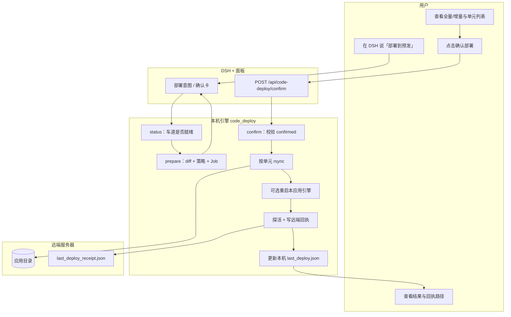
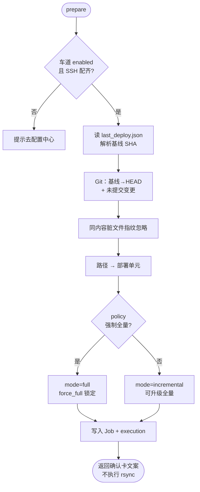
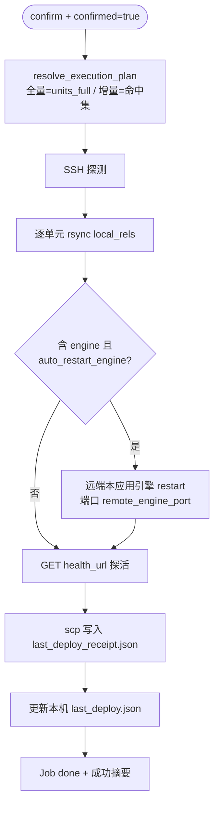
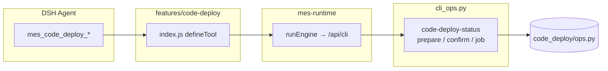

# P1 自动化部署（按单元增量）功能实现说明

> **状态**：已实现（P1 MVP）  
> **范围**：本机 SSH + rsync → 预发/staging；按**部署单元**增量同步；人确认后才执行  
> **不包含**：GitHub Actions、自动定时部署、生产环境默认可开、Cursor Cloud 部署

---

## 1. 一句话总结（给非技术人员）

用户在 DSH 聊天里说「部署到预发 / 部署上线」时，系统**不会立刻改服务器**，而是先对比「上次成功部署」和「当前本机代码」差了哪些部分，算出这次该同步哪些**单元**（例如只改了引擎、或只改了某个插件），再弹出**确认卡**。人点确认后，才用本机私钥经 SSH 把对应目录同步到服务器；需要时只重启**本应用自己的引擎**，默认**不重启整台 DSH**，避免影响同机其它项目。成功后服务器上会落下一份「回执文件」，列出本次实际同步了哪些路径。

**全量 vs 增量（大白话）**

| 说法 | 含义 |
| --- | --- |
| **增量** | 只同步「这次改动碰到」的那几个单元（如只要 `engine`） |
| **全量** | 同步目录里登记的**全部**单元（首次上线、脚手架大改、远端空目录等） |

系统判定结果只有这两种，**没有**「建议全量但你可以改成增量」的中间态。增量时可手动**升级**为全量；强制全量时**不能**改回增量。

---

## 2. 达到的效果

| 效果 | 说明 |
| --- | --- |
| **人先确认再动手** | 聊天只出确认卡；须点确认或 Agent 显式 `confirmed=true` 才 rsync |
| **按插件/层增量** | 变更映射到 `feature:*` / `engine` / `bridge` 等单元，未命中的目录不动 |
| **二元策略清晰** | 只有全量（可锁定）或增量；禁止「建议全量」软模式 |
| **密钥不上传** | `config.yaml`、私钥、`.env` 等在 rsync 排除列表里 |
| **共享机安全** | 远端引擎独立端口（默认 8091）；停引擎只杀本应用 PID；默认不重装 DSH |
| **成功可核对** | 远端写入 `last_deploy_receipt.json`（部署流水线在 rsync 后写入） |
| **热插拔** | `code-deploy` feature 可 ~1s 启停；不改 DSH 本体 |
| **模型不执行 SSH** | Agent 只能 prepare / 带确认的 confirm；真正 SSH 在引擎进程内 |

---

## 3. 用到的技术

### 3.1 技术清单

| 技术 | 用在哪 | 作用 |
| --- | --- | --- |
| **DSH + Cordis** | 聊天宿主、`mes-bridge` | 面板 UI、Agent 会话、工具注册 |
| **FastAPI** | 本机引擎 | HTTP：`/api/code-deploy/*`、与 CLI 同源 |
| **Python 3** | `engine/app/code_deploy/` | 意图、策略、diff、Job、SSH/rsync |
| **Git** | 本机工作区 | 相对 `last_deploy` SHA → HEAD 算变更（含未提交） |
| **SSH + rsync** | 本机 → 远端服务器 | 按单元路径同步；私钥只存本机路径 |
| **Node.js（feature）** | `features/code-deploy/` | 薄封装：`runEngine` 调 CLI，无 npm 业务逻辑 |
| **nginx（运维侧）** | 共享机公网入口 | 如 `8092 → 127.0.0.1:8091`；探活用公网 URL |

### 3.2 大白话：这些技术各自干什么？

- **DSH**：前台；用户说话、看确认卡与结果。
- **引擎（本机后厨）**：真正算「全量还是增量」、跑 rsync 的服务；只听本机回环，不对外网开放。
- **部署单元**：把仓库切成可独立同步的「盒子」（某个插件、整块引擎、bridge 等）。改了哪个盒子，就只搬哪个盒子。
- **last_deploy.json（本机）**：记下上次成功部署时的 Git 基线与脏文件指纹，下次对比才知道「新改了什么」。
- **SSH/rsync**：本机用私钥登录服务器，把选定目录拷过去（内容相同的文件通常不会重写）。
- **回执 JSON（服务器）**：部署成功后，由**本机部署流水线**经 scp 写到远端；内容是「这次声明同步了什么」。它便于核对，但是**部署端自述**，不是服务器独立盘点（独立核对可用文件 ctime，见 §9）。
- **feature（code-deploy）**：给 Agent 的菜单：`mes_code_deploy_status|prepare|confirm`。

---

## 4. 架构分层与实现机制

### 4.1 分层（铁律）

```text
┌─────────────────────────────────────────────────────────────┐
│  DSH 聊天 + mes-bridge 面板                                   │
│  · 部署意图 → 确认卡 · 人点确认 · 展示成功摘要 / 回执路径        │
└──────────────────────────┬──────────────────────────────────┘
                           │ HTTP 127.0.0.1（本机引擎）
┌──────────────────────────▼──────────────────────────────────┐
│  引擎 FastAPI（code_deploy/*）                                │
│  · 策略二元判定 · Git diff→单元 · Job · confirm 后 SSH/rsync  │
└──────────────────────────┬──────────────────────────────────┘
                           │ SSH + rsync（本机私钥）
┌──────────────────────────▼──────────────────────────────────┐
│  远端服务器（如 staging）                                     │
│  · 应用根目录布局与本仓一致 · 本应用引擎 :8091 · nginx 探活    │
│  · last_deploy_receipt.json（本次同步范围回执）               │
└─────────────────────────────────────────────────────────────┘

侧向：features/code-deploy → runEngine → cli_ops（与 HTTP 同源）
本机账本：engine/data/code_deploy/last_deploy.json + jobs/*.json
```

### 4.2 核心机制说明

#### （1）HITL：人确认后才部署

- 聊天 `/api/chat` 识别部署意图后，走 prepare：只返回确认卡相关 UI，**不**执行 rsync。
- **唯一执行入口**：`POST /api/code-deploy/confirm`（或 CLI / `mes_code_deploy_confirm`，且 `confirmed=true`）。
- 目的：防止模型听一句「帮我部署一下」就改服务器。

#### （2）部署单元（增量的灵活核心）

变更路径 → 单元 id → rsync 源目录 + 动作：

| 变更路径 | 单元 id | 动作 |
| --- | --- | --- |
| `features/<id>/` | `feature:<id>` | 只同步该插件目录；热加载，不重启 |
| `engine/app/**`、`engine_cli.py`、`requirements.txt`、`engine/config/*`（**不含** `config.yaml`） | `engine` | 同步后可 `engine.sh restart`（本应用） |
| `plugins/mes-bridge`、`mes-runtime` | `bridge` | **仅同步文件**；默认不重启 DSH（`auto_restart_bridge=false`） |
| `.dsh/skills/` | `skills` | 仅同步 |
| `scripts/` | `scripts` | 仅同步（触及 scripts 常触发**强制全量**） |
| `docs/**`、`engine/data/**`、真实 `config.yaml` 等 | （跳过） | 默认不部署 / 不因密钥文件强制全量 |

**例：** 只改了 `code-commit`、`code-dev` → 确认卡只有这两个 feature 单元；引擎、bridge、其它插件**不动**。

确认执行以 `job.execution` 为准：全量 = 目录全部单元；增量 = prepare 命中集（**忽略**客户端擅自瘦身漏发）。

#### （3）二元策略：全量（锁定）或增量

强制全量（不可改回增量）常见原因：

- 无 `last_deploy.json`（首次）
- 上次 SHA 在本仓库解析失败
- 远端应用目录为空
- 变更触及 `scripts/`、`vendor/`、根 `package.json`、profile/`cordis.patch` 等脚手架
- 存在未映射到单元的**关键**业务路径
- 命中单元数 ≥ 6
- scripts 与 engine/bridge 等组合条件（见 `policy.py`）

否则 → **增量**：只同步 diff 命中单元；允许人升级为全量。

#### （4）基线与「部署过又强制全量」

成功部署后本机写入 `last_deploy.json`：

- `sha`：当时 HEAD
- **脏文件内容指纹**：与上次相同的未提交文件，下次对比会**忽略**，避免「同一脏文件永远逼你全量」

`requirements.txt`、bridge 源码等映射到 **engine/bridge 增量**，不再当成「未映射 → 强制全量」。

#### （5）共享机安全

- 远端引擎默认 **8091**（可配 `remote_engine_port`），**禁止默认抢 8000**
- `health_url` 填公网探活（如 nginx `:8092`）；**不要**把反代口当成引擎端口
- `engine.sh stop/restart` 只杀本应用 PID（校验 cmdline/cwd）
- `auto_restart_bridge` 默认 false；远端无完整 DSH profile 时拒绝 install
- 远端独立 `.venv`；rsync 排除 `.venv` / `config.yaml` / 密钥类文件

#### （6）服务器回执

rsync（及必要的引擎重启、探活）成功后，部署流水线向远端写入：

`{ssh_app_path}/apps/zr-workbuddy/engine/data/code_deploy/last_deploy_receipt.json`

关注：`mode`、`unit_ids`、`synced_rels`、`rsync_results`、`engine_restart`。  
说明：这是**本次部署任务写出的声明**；若需文件系统旁证，见 §9。

---

## 5. 详细流程图

### 5.1 总览：从用户说话到服务器更新



### 5.2 准备阶段：全量 / 增量判定



### 5.3 确认执行与回执



### 5.4 Agent / Feature 工具链



---

## 6. 关键模块与文件

| 模块 | 路径 | 职责 |
| --- | --- | --- |
| 配置 | `code_deploy/config.py` | 读 `code_deploy:`；SSH 校验；排除列表 |
| 意图 | `code_deploy/intent.py` | 「部署到预发」等意图 |
| 单元映射 | `code_deploy/units.py` | 路径↔单元；全量单元目录 |
| 策略 | `code_deploy/policy.py` | 二元全量/增量判定 |
| Diff | `code_deploy/diff_map.py` | Git 变更与脏文件 |
| 存储 | `code_deploy/store.py` | `last_deploy.json`、jobs |
| SSH/rsync | `code_deploy/ssh_sync.py` | 同步、远端引擎、回执 |
| 命令面 | `code_deploy/ops.py` | status/prepare/confirm 统一入口 |
| 聊天桥 | `code_deploy/chat_bridge.py` | 聊天出确认卡，不自动 rsync |
| HTTP | `main.py` | `/api/code-deploy/*` |
| Feature | `features/code-deploy/index.js` | Agent 工具 |
| 面板 | `mes-bridge` 客户端 | 确认卡 / 成功摘要 |
| 单测 | `engine/tests/test_code_deploy.py` | 策略、映射、确认计划等 |

---

## 7. 配置与数据目录

### 7.1 配置（配置中心 → `config.yaml`）

界面核心项（仅本机 SSH，**无** GitHub Actions）：

| 界面含义 | 配置键 | 说明 |
| --- | --- | --- |
| 开启自动化部署 | `enabled` | 默认 false |
| 部署方式 | `provider` | 固定 `local_ssh` |
| 默认分支/对比 | `default_ref` | 常用 `HEAD` |
| 探活地址 | `health_url` | 公网入口，如 `http://x.x.x.x:8092/` |
| 远端引擎端口 | `remote_engine_port` | 默认 `8091`（回环） |
| 本机项目路径 | `default_workspace` | Git 仓库根 |
| 主机/用户/端口/私钥/远端目录 | `ssh_*` | 私钥只存路径，不上传内容 |
| 同步后重启引擎 | `auto_restart_engine` | 默认 true |
| 同步后重装 DSH | `auto_restart_bridge` | 默认 **false** |

环境白名单等有默认值（如 `staging`）；生产默认不开。示例见 `config.example.yaml`；真实密钥勿提交。

### 7.2 运行时数据

| 路径 | 内容 |
| --- | --- |
| 本机 `engine/data/plugins.json` | feature 启停（含 `code-deploy`） |
| 本机 `engine/data/code_deploy/last_deploy.json` | 成功基线 SHA + 脏文件指纹 |
| 本机 `engine/data/code_deploy/jobs/*.json` | Job 全流程账本（权威之一） |
| 远端 `…/engine/data/code_deploy/last_deploy_receipt.json` | 最近一次成功部署的同步范围回执 |

---

## 8. 主要 API（引擎）

| 接口 | 方法 | 说明 |
| --- | --- | --- |
| `/api/code-deploy/status` | GET | 车道是否就绪（开关、SSH、环境） |
| `/api/code-deploy/prepare` | POST | 出确认计划与 Job，**不** rsync |
| `/api/code-deploy/confirm` | POST | 人确认后执行；须确认语义 |
| `/api/code-deploy/jobs/{id}` | GET | 查询 Job |

CLI 同源：`code-deploy-status`、`code-deploy-prepare`、`code-deploy-confirm`、`code-deploy-job`。

Agent 工具：`mes_code_deploy_status`、`mes_code_deploy_prepare`、`mes_code_deploy_confirm`（后者必须 `confirmed=true`）。

执行契约：

| 判定 | UI | 确认执行 |
| --- | --- | --- |
| 全量（`force_full`） | 锁定「全量」，无增量选项 | 同步 `units_full` |
| 增量 | 默认增量；可升级全量 | 同步 prepare 命中集（忽略客户端瘦身） |

---

## 9. 服务器上如何核对「全量还是增量」

### 9.1 看回执（便捷，但是部署端自述）

```bash
cat /www/wwwroot/DSH-ZR-WorkBuddy/apps/zr-workbuddy/engine/data/code_deploy/last_deploy_receipt.json
```

| 字段 | 怎么读 |
| --- | --- |
| `mode` / `mode_label` | `incremental`/`增量` 或 `full`/`全量` |
| `unit_ids` | 增量通常 1～几个；全量接近目录全部单元（约十余个量级） |
| `synced_rels` | 本次声明要 rsync 的路径列表 |
| `rsync_results` | 各单元是否 ok 及日志摘要 |
| `note` | 正常应为「由 code-deploy 在远端写入」；若含「回填」/`backfilled` 则不可信 |

成功卡片里的「数据源：按插件增量部署」是**产品能力名**，不等于这一次一定是增量——以回执 `mode` 为准。

### 9.2 文件系统旁证（服务器自己「发生了什么」）

`rsync -a` 会保留源文件的修改时间，所以看 **mtime** 不准；应看近期 **ctime**（被写入/换 inode 元数据的时间），且内容未变的文件可能根本不会出现：

```bash
find /www/wwwroot/DSH-ZR-WorkBuddy/apps/zr-workbuddy \
  \( -path '*/engine/*' -o -path '*/plugins/*' -o -path '*/features/*' \) \
  -type f -cmin -30 \
  ! -name 'engine.log' ! -name 'last_deploy_receipt.json' \
  | head -50
```

- 增量：通常只有部分目录出现；`features/` 往往几乎不动  
- 全量：多单元目录会大面积出现 ctime 更新  

### 9.3 本机 Job（部署机权威账本）

`apps/zr-workbuddy/engine/data/code_deploy/jobs/<job_id>.json` 中的 `mode`、`execution.unit_ids`、`deploy_result.remote_receipt_ok` 记录完整决策与是否写回执成功。

---

## 10. 风险点

| 风险 | 现状 | 缓解 |
| --- | --- | --- |
| **误部署整机** | rsync/重启影响同机其它服务 | 独立端口；只杀本应用 PID；默认不重启 DSH |
| **密钥上服务器** | 同步 `config.yaml`/私钥 | rsync 排除；单元映射跳过真实 config.yaml |
| **未确认就部署** | Agent 误调 | confirm 须 `confirmed=true`；聊天不自动执行 |
| **增量漏文件** | 映射不全 / 基线失效 | 未映射关键路径或基线失效 → 强制全量 |
| **把 nginx 口当引擎口** | 误停外网反代 | `remote_engine_port` 与 `health_url` 分离 |
| **回执被当成独立审计** | 回执由部署端生成 | 文档标明自述；可用 ctime 旁证 |
| **回执写入失败** | 旧版 ssh python -c 引号问题 | 改为本机写临时文件再 scp；看 `remote_receipt_ok` |
| **脏文件逼全量** | 未提交文件反复出现 | 脏文件内容指纹，同内容忽略 |
| **引擎 HTTP 无鉴权** | 仅 127.0.0.1 | 不对 LAN/公网暴露本机引擎 |

---

## 11. 后续优化与扩展建议

### 11.1 近期

| 项 | 说明 |
| --- | --- |
| **远端侧审计日志** | 在服务器进程内 append「收到哪些路径」的独立日志，减少「纯客户端自述」争议 |
| **rsync itemize 落盘** | 把真正传输的文件列表写入回执 |
| **Job 历史 SPA** | 引擎页列出历史部署与单元 |

### 11.2 中期 / 明确不做（本 MVP）

- GitHub Actions / 境外 CI 直连国内机  
- 定时自动部署、无人确认部署  
- 默认开放生产环境  
- 第二个 bridge 或业务正式 Cordis 包  
- 在 feature 里直接 `spawn` SSH（算数必须在 engine）

---

## 12. 验收对照（简表）

1. 配置中心可开关部署车道并填 SSH；未启用时有明确提示  
2. 「部署到预发」→ 确认卡展示全量或增量 + 单元列表，**不**立刻改服务器  
3. 未点确认 / `confirmed=false` → 无 rsync  
4. 只改一个 feature → 增量且仅该单元；首次或脚手架变更 → 锁定全量  
5. 成功后探活通过；远端出现回执且 `mode`/`unit_ids` 与卡片一致；本机 `last_deploy.json` 更新  
6. 共享机：不占用他项目 8000；默认不重启整台 DSH  
7. `disable code-deploy` 后工具热卸  

---

## 13. 相关文档

| 文档 | 说明 |
| --- | --- |
| [功能迁移-写码审码提交自动化.md](../功能迁移-写码审码提交自动化.md) | 总方案；部署为 P1 |
| [P0-1-本机写码功能实现.md](./P0-1-本机写码功能实现.md) | 写码 HITL / 沙箱体例参考 |
| [P0-2-人触发提交功能实现.md](./P0-2-人触发提交功能实现.md) | 提交 HITL |
| [目录结构与用法说明.md](../目录结构与用法说明.md) | 日常命令与分层 |
| [AGENTS.md](../../AGENTS.md) | 写码/插件架构铁律 |
| [复盘 2026-09-03](../复盘总结/2026-09-03.md) | P1 落地与共享机安全复盘 |
