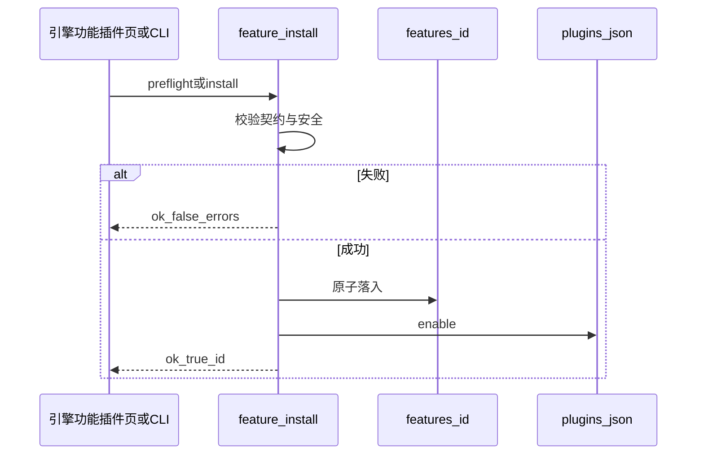

# P2 第三方插件安装使用功能实现

> **状态**：已实现（阶段 A + 阶段 B）· **服从** [三大核心目标](../三大核心目标落地方案.md) **G3**  
> **范围**：契约校验、样例包、目录/zip 一键安装、引擎 API、功能插件页上传启停与卸载  
> **业务验收**：引擎「功能插件」页列表可见、可启停；不合规包中文拒绝  
> **不包含**：git URL、来源白名单、签名；**不以 DSH 聊天热挂为安装成败条件**（见 `AGENTS.md` §0）

---

## 1. 一句话总结（给非技术人员）

把别人做好的能力包（一个文件夹或 zip）交给 WorkBuddy：系统先检查格式合不合格，合格就装进本机的「功能插件」目录并打开开关，你可以在引擎网页上看到、关掉或卸掉。之后若只改了这个插件，部署时可以只同步这一块。

**设计原则：只进 `features/`；校验不过不装；安装成功看引擎页，不依赖是否打开 DSH。**

---

## 2. 达到的效果

| 效果 | 说明 |
| --- | --- |
| **像装技能** | 目录或 zip → 校验 → 落入 `features/<id>/` → enable |
| **契约统一** | 与自研 feature 同一套：`index.js` + `manifest.json`，禁止 npm import |
| **中文拒绝** | 非法 id、缺文件、含 npm、zip 穿越等给出可读错误 |
| **引擎可管** | 功能插件页：列表、启停、上传安装、卸载（可进隔离区） |
| **CLI 同源** | `plugin.sh check-features` / `install-feature` |
| **G2 可增量** | 仅该目录变更时命中 `feature:<id>` |
| **架构保留** | 不删 Bridge；有人跑 DSH 时同一目录可被热挂（非本功能验收项） |

---

## 3. 用到的技术

| 技术 | 用在哪 | 作用 |
| --- | --- | --- |
| **FastAPI + multipart** | `/api/plugins/preflight\|install` | 上传 zip、校验与安装 |
| **Python** | `engine/app/feature_install.py` | 校验、解包、原子落入、隔离卸载 |
| **plugins_store** | `plugins.json` | 启停真相源（已有） |
| **引擎 SPA** | `static/index.html` | 安装向导 + 列表 |
| **plugin.sh** | CLI | 本机目录/zip 安装与批量检查 |

---

## 4. 架构与流程

```text
第三方 zip/目录
      │
      ▼
feature_install.validate ──失败→ 中文 errors[]
      │通过
      ▼
原子落入 features/<id>/  →  plugins_store.enable
      │
      ▼
引擎「功能插件」页列出（扫描 index.js，无白名单）
```



### 分期

| 阶段 | 内容 |
| --- | --- |
| **阶段 A** | 校验器、`check-features`、样例包、单测 |
| **阶段 B** | 目录/zip 安装、HTTP、SPA 上传、卸载 quarantine |

后续增强（本文件外）：git 源、域名白名单、签名。

---

## 5. 第三方交付物

```text
<id>/
  manifest.json
  index.js
  README.md
```

`manifest.json` 必填字段：`id`（与目录名一致）、`name`、`purpose`；推荐 `version`、`author`。  
可选：`requires_engine_commands`、`inject`。若声明的引擎命令未注册 → 警告 `needs_engine_merge`，仍可 enable，但不得当作「算数已齐」。

样例：`docs/examples/sample-third-party/`（id=`sample-third-party`）。

---

## 6. 接口与命令

### CLI

```bash
scripts/plugin.sh --app zr-workbuddy check-features
scripts/plugin.sh --app zr-workbuddy check-features sample-third-party
scripts/plugin.sh --app zr-workbuddy install-feature /path/to/plugin-dir
scripts/plugin.sh --app zr-workbuddy install-feature ./plugin.zip [--force]
scripts/plugin.sh --app zr-workbuddy uninstall-feature <id> [--purge]
```

### HTTP（tags：功能热插拔）

| 方法 | 路径 | 说明 |
| --- | --- | --- |
| POST | `/api/plugins/preflight` | 只校验（multipart `file` 或 JSON `path`） |
| POST | `/api/plugins/install` | 校验 + 安装 + enable（`force` 可选） |
| DELETE | `/api/plugins/{id}` | 停用；`purge=true` 移入 `engine/data/feature_quarantine/` |

### 配置（`config.yaml` → `feature_install`）

```yaml
feature_install:
  max_zip_bytes: 5242880
  max_files: 200
  allow_force: true
```

---

## 7. 「使用」与验收

| 验收项 | 通过标准 |
| --- | --- |
| 装合规包 | 引擎列表出现且默认 ON |
| 装违规包 | `ok=false` + 中文错误，目录不落地 |
| 启停 | 开关写 `plugins.json`，列表状态正确 |
| 卸载 purge | 目录离开 `features/`，进 quarantine |
| DSH 未开 | **不作为失败** |

---

## 8. 风险与禁令

| 风险 | 对策 |
| --- | --- |
| zip-slip | 解压路径必须落在临时根下 |
| npm 供应链 | 静态拒绝 `import`/`require` 包名 |
| 覆盖已有插件 | 默认拒绝，须显式 force |
| 密钥进包 | 约定禁止；校验不扫描密钥全文（后续可增强） |
| 误当业务失败 | 无 bridge / 无 DSH 不算安装失败 |

**禁令**：安装器不得改成往 profile 塞正式 Cordis 包；不得删 Bridge；密钥不进 feature。

---

## 9. 关键文件

| 路径 | 职责 |
| --- | --- |
| `engine/app/feature_install.py` | 校验 / 安装 / 卸载 |
| `engine/app/plugins_store.py` | 列表补 version 等；启停 |
| `engine/app/main.py` | HTTP |
| `engine/app/static/index.html` | 安装 UI |
| `scripts/plugin.sh` | CLI |
| `docs/examples/sample-third-party/` | 样例 |
| `engine/tests/test_feature_install.py` | 单测 |

---

## 10. 一句话结论

**第三方能力只经校验装进 `features/`，用引擎页启停与使用；DSH 架构保留，宿主可不上。**
