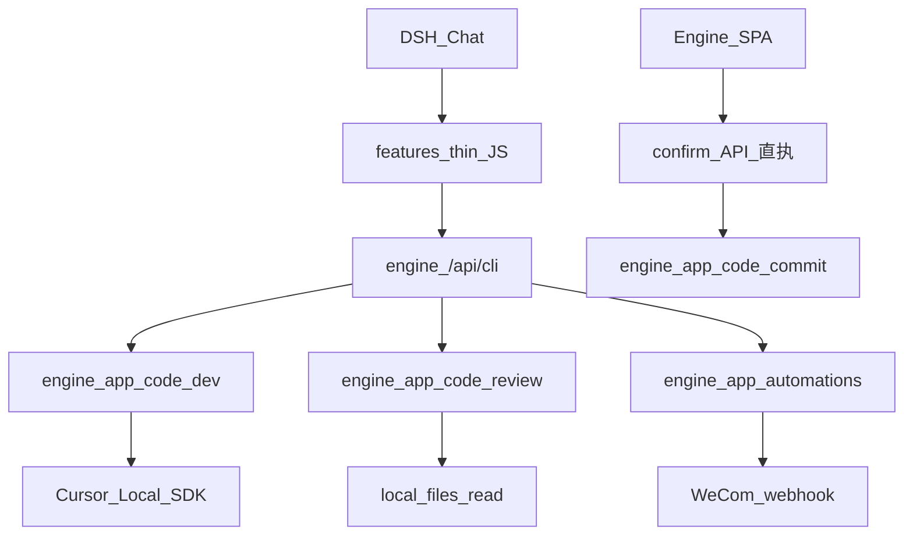

# 功能迁移方案：写码 / 审码 / 提交 / 自动化

> **状态**：已定稿（决策已确认）  
> **约束**：不动 simplified-workbuddy 源码；不动本仓架构铁律（见根目录 `AGENTS.md`）  
> **落地纪律**：**P0 按条复制，每条由人工确认通过后再做下一条**，避免大面积回归。

---

## 1. 硬约束（强制）

1. **simplified 只读**：允许对照 / 拷贝进本仓后改编；禁止改源仓文件。  
2. **DSH-ZR-WorkBuddy 架构不动**：  
   - 新 Agent 能力只进 `apps/zr-workbuddy/features/`  
   - 算数与旁路执行只进 `engine/app/`，经 `runEngine` → `/api/cli`（`cli_ops.py` 单轨）  
   - 唯一常驻 Cordis 包仍是 `mes-bridge`；禁止再装业务正式包  
   - feature **禁止** `import` / `require` npm（含 `cursor-sdk`）  
   - 密钥 / URL 只进 `engine/config/config.yaml`（示例写 `config.example.yaml`）  
   - 引擎只绑 `127.0.0.1`；禁止 Node 里 `spawn uvicorn`  
3. **人确认铁律**：高风险动作（提交等）必须 **prepare → 人点确认 → API/CLI 直执**，禁止「模型再说一遍确认」当执行。  
4. **自动化禁止**自动写码 / 提交 / 部署。

---

## 2. 已确认决策

| # | 项 | 结论 |
|---|-----|------|
| 1 | 写码通道 | **本机 Cursor Local**（不迁 Cloud） |
| 2 | 人确认 UI | **P0 用引擎 SPA 确认页** + prepare/confirm 两步工具 |
| 3 | 自动化 P0 | **固定模板 + 企微**；不做任意自然语言定时 Agent |
| 4 | 审码 | **本机选项目路径直读审码，不用 IDE Bridge**（可行，见 §5.2） |
| 5 | 部署 | **P1 已落地**：按单元增量/全量 + SSH；人只确认，含 bridge 默认重启远端 DSH（见 `docs/功能实现/P1-自动化部署-按单元增量.md`） |

### 2.1 决策 4：无 Bridge 本机审码为何可行

- 引擎与目标工程**同机**（`127.0.0.1`）。  
- simplified 已有同机直读：`ide_review/local_files.py` + `git_review(local_path=…)`。  
- P0：引擎 SPA **路径输入**（可选树浏览）+ Agent 工具传 `local_path`；路径规范化、后缀白名单、体积/文件数上限。  
- **不做** VS Code Bridge / 扩展；远程 Git 克隆审码列为 P1。

---

## 3. P0 / P1 范围

### P0（按条确认）

| 顺序 | 能力 | feature id（建议） | 说明 |
|------|------|-------------------|------|
| **P0-1** | 本机 Cursor Local 写码 | `code-dev` | 校验目录 → 沙箱 → Cursor Local → 同步变更；默认可关 |
| **P0-2** | 人触发提交 | `code-commit` | 选目录 → 门禁 findings → **确认卡** → commit/push；默认 push |
| **P0-3** | 本机目录直读审码 | `code-review` | 无 Bridge；复用 `local_files` 守卫 |
| **P0-4** | 固定模板 + 企微自动化 | `automations` | 调度在引擎内；**重写 executor**（不调 Deep Agents） |

### P1（相对 P0 的后续）

| 能力 | 状态 | 说明 |
|------|------|------|
| 按单元增量/全量部署（SSH） | **已落地** | `code-deploy`；人确认后系统收尾（含 bridge→默认重启远端 DSH） |
| Cursor Cloud / IDE Bridge | 不做（本阶段） | — |
| 飞书多维表、任意自然语言定时任务 | 不做（本阶段） | — |
| DSH `approval` 深度集成 | 可后补 | — |
| GitHub Actions / 境外 CI 直连 | 明确不做（MVP） | 见 P1 文档 §11 |
---

## 4. 目标架构



| 层 | 放什么 | 不放什么 |
|----|--------|----------|
| `features/*` | `defineTool` + `runEngine` | npm、定时器、密钥、业务逻辑 |
| `engine/app/*` | Job、沙箱、git、审码读盘、调度、企微 | Vue ChatView、Deep Agents |
| `mes-runtime` | 仅当必须封装 Node 库时 | 默认不把 cursor-sdk 放这里（用 Python） |
| bridge `client.js` | 尽量不改 | 确认卡（用 SPA） |

---

## 5. 分功能方案

### 5.1 P0-1 写码（本机 Cursor Local）

**复用（只读拷贝后改编）**  
simplified `apps/local_dev/` 中与沙箱 / Job / workspace / fs_snapshot / cursor_local_agent 相关模块。

**本仓落点**  
`apps/zr-workbuddy/engine/app/code_dev/` + `features/code-dev/`。

**CLI**

- `code-dev-status` — 开关、SDK、Key 是否就绪  
- `code-dev-check` — 校验本机目录  
- `code-dev-start` / `code-dev-confirm` — 创建 Job（**聊天路径禁止自动 start**；须确认卡或 CLI 显式调用）  
- `code-dev-job` — 查询 Job  
- `code-dev-cancel` — 请求取消  

**聊天 HITL（对齐 simplified）**  
面板/SPA 发写码诉求 → 思考过程 → **需求选项卡** → 用户确认选项 → **写码确认卡** → 用户点确认 → `POST /api/code-dev/confirm` 开工 → **进度卡 SSE**（`GET /api/code-dev/jobs/{id}/stream`）→ 终态展示同步文件与改码小结。  
禁止「有路径就直接启动 Job」。

**默认**：在引擎 SPA **配置中心 → 写码车道** 开启（写入 `config.yaml` 的 `code_dev`）；未开启时 start 拒绝执行。  
**不做（P0-1）**：提交门禁、预览起服、Cloud、截图视觉、LLM fallback 写码环。

### 5.2 P0-3 本机审码（无 Bridge）

复用 `local_files`（列表/限流读/敏感跳过）+ 引擎 LLM（Viprasol Skill）+ `enrich` 规则补种。  
对话确认卡 → **`POST /api/code-review/run/stream`**（SSE 进度 + 终稿逐行流式）；终稿体例「代码审核汇总报告」。  
Agent 工具：`mes_code_review_*`。实现说明见 `docs/功能实现/P0-3-本机审码功能实现.md`。

数据目录：`engine/data/code_review/reports/`。
### 5.3 P0-2 人触发提交

复用 / 改编 `git_ops` / `gate` / `skill_review`（Skill 走 `llm_freeform`，禁止 LangChain）。

**产品流（已确认）**

1. 用户说「提交代码」→ 对话出现**选目录确认卡**（对齐审码 pick）。  
2. 点「开始门禁审核」→ `POST /api/code-commit/start`：列出待提交文件（功能源码 + 文档/Skill/HTML/gitignore 等；优先 Git dirty）→ 门禁**仅** P0/P1 阻断；返回 findings **列表**（**不**出全量「代码审核汇总报告」）。阻断则不可提交。  
3. 门禁通过 → 确认卡（中文说明、默认 push=true）→ 人点确认 → `POST /api/code-commit/confirm` 在工作分支 commit + 可选 push。  
4. **模型不执行 git**；聊天路径禁止自动 start/confirm。

**落点**：`engine/app/code_commit/` + `features/code-commit/`；配置中心「提交车道」；数据 `engine/data/code_commit/jobs/`。

实现说明见 `docs/功能实现/P0-2-人触发提交功能实现.md`。

### 5.4 P0-4 自动化

复用 store / schedule / wecom；**重写** executor 为固定模板流水线。  
引擎 startup 轻量 tick；feature 仅 list / run-now。

---

## 6. 禁止清单（勿拷）

- `apps/web/**`（ChatView、确认卡、chatIntent）  
- `apps/agent/**` Deep Agents / Skills / Middleware（可抽 `local_files` 等纯函数）  
- `desktop/**`、Cursor Cloud 整包、部署模块（P0）  
- 独立 `:8765` API 进程（并入现有 engine `:8000`）

---

## 7. 配置与数据目录约定

**所有业务配置一律走引擎「配置中心」UI**（与 simplified「系统配置」同类；保存走 `/api/config` → `config.yaml`），禁止要求用户手改 yaml 作为主路径。

`config.example.yaml` / 配置中心「写码车道」字段：

```yaml
code_dev:
  enabled: false
  cursor_api_key: ""
  model: composer-2.5
  max_concurrent: 1
  cursor_timeout_sec: 2700
  default_workspace: ""   # 可选备忘路径
```

后续提交 / 审码 / 自动化 / 企微密钥同样进配置中心分节（P0-2～P0-4），密钥字段走 `SECRET_PATHS` 脱敏。

数据目录：`engine/data/local_dev/`（jobs/sandboxes）、`engine/data/code_review/`（审码报告）、后续 `automations/`。

---

## 8. 实施纪律（人工闸门）

```text
文档定稿
  → P0-1 写码 → 【你确认】
  → P0-2 提交 + SPA 确认 → 【你确认】
  → P0-3 本机审码 → 【你确认】
  → P0-4 企微模板自动化 → 【你确认】
```

每条要求：改动面可控；默认关闭；有单测或手工验收；`check-secrets` 通过；**不**顺手开下一条。

---

## 9. P0-1 验收话术

1. 打开引擎 SPA「配置中心 → 写码车道」：可勾选开启、填 Key/模型并「保存全部配置」。  
2. 未开启时：`code-dev-start` / 工具返回明确「未开启」。  
3. 开启并保存后点「测试写码就绪」或 `code-dev-status` 显示就绪（需已装 `cursor-sdk`）。  
4. 聊天发写码需求（含增量改功能/消息中心等）：出现**思考过程** + **需求选项卡或写码确认卡**；`done` 必须带 `code_dev_ui`，**不会**直接「已启动 ldj-…」。  
5. 勾选并「确认选项」→ 出现**写码确认卡**；点「确认并用 Cursor 写入本机」后出现**进度卡**，完成后展示同步文件与小结。  
6. `code-dev-check` 对非法路径失败、对工程目录成功；`code-dev-job` 可查终态。  
7. `plugin.sh disable code-dev` 后工具热卸；`mes_code_dev_start` 须 `confirmed=true`。  
8. **不**自动 git commit / push / 部署。

> 面板 `client.js` 已同步 HITL 卡片；改 bridge 后需刷新面板（或 `install bridge --restart`）才能看到。

---

## 10. 风险摘要

| 风险 | 缓解 |
|------|------|
| 误改本机工程 | 默认 `enabled:false`；沙箱先改再受限同步；敏感路径跳过 |
| cursor-sdk / 额度 | status 清晰报错；失败不半截同步 |
| 拷贝面过大 | P0-1 只改编写码最小集 |
| 确认靠口头 | 提交留给 P0-2 SPA |

---

## 11. 相关文档

- 本仓：`AGENTS.md`、`docs/目录结构与用法说明.md`  
- 功能实现：`docs/功能实现/P0-1`～`P0-3`、`P1-自动化部署-按单元增量.md`  
- 源仓（只读）：`docs/功能实现/00`、`08`～`11`；`apps/local_dev/`